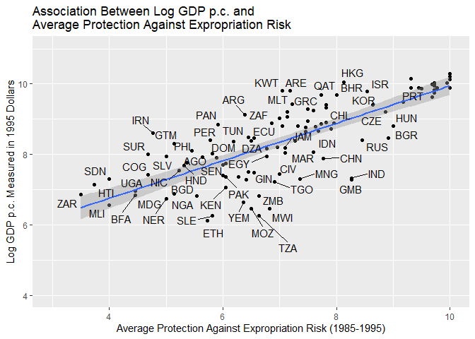
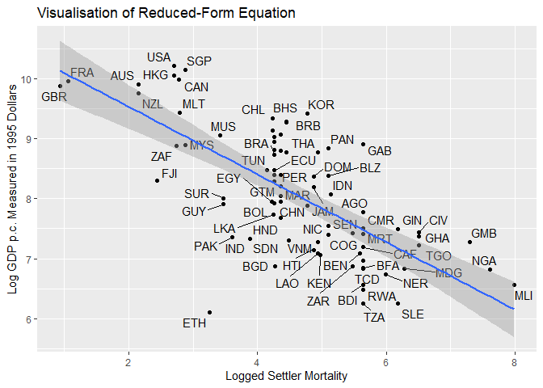

Some fairly wild notes on causal inference
================
Jacob Edenhofer[^1]
17 February 2023

# Preliminaries

``` r
# packages 
library(readr) # importing csv files 
library(haven) # importing dta data files 
library(tidyverse) # data wrangling and plotting 
library(ggrepel) # adding text labels to graphs 
library(kableExtra) # creating tables 
library(multiwayvcov) # robust standard errors 
library(ivpack) # iv regressions 
library(Matching) # matching 
library(cobalt) # matching 
library(sm) # matching 
library(ggeffects) # marginal effects
library(margins) # marginal effects
library(fixest) # fixed effects 
library(ggpubr) # saving graphs
library(modelsummary) # regression tables 
library(stargazer) # regression tables 
library(estimatr) # robust estimation of (linear) models
library(rdd) # rdd 
library(rddensity) # rdd
library(rdrobust) # rdd

# data 
ajr <- read_dta("Data/AJR.dta")
vietnam <- read_stata("Data/Vietnam_matching.dta")
did_snow <- read_delim("Data/snow_did.csv", delim = ";")
fowler_assembly <- read_stata("Data/StateAssemblyData.dta")
fowler_census <- read_stata("Data/StateCensusData.dta")
broockman <- read_stata("Data/Broockman2009.dta")
audit <- read_delim("Data/audit.csv", delim = ",")
stigma <- read_stata("Data/stigma.dta")
# delete missing values 
stigma1 <- stigma %>%
  filter(!is.na(stigma))
```

# Causal identification and controls

## Experimental data

Let us, first, consider the rationale for adding controls with
experimental data. The random allocation of treatment in experiments
ensures that all units are equally likely to receive treatment, implying
that, with respect to pre-treatment characteristics, the units in the
treatment and control groups are identical or *exchangeable*. The
implication being that the potential outcomes of these two groups are
independent of treatment (X), namely
${Y_{i}^{0}, Y_{i}^{1}} \perp\kern-5pt\perp X_{i}$. If this holds,
simple differences in means are an unbiased estimator for the average
treatment effect (ATE). The ATE is
$E(Y_{i}^{1} \vert X_{i}=1) - E(Y_{i}^{0} \vert X_{i}=0)$, where
$Y_{i}^{0}$ and $Y_{i}^{1}$ denote $i’s$ potential outcomes when not
receiving and receiving treatment respectively.[^2] Thus, with
experimental data, it is not *necessary* to include covariates to
identify the causal effect of X on Y.

Adding controls, albeit not necessary for the unbiased estimation of the
ATE in experiments, can be desirable for two reasons. (1) If
pre-treatment covariates are strongly predictive of the (potential)
outcomes, including these covariates will reduce the standard error of
the estimated causal effect. That is, adding controls allows us to
estimate the causal effect with greater precision, relative to taking
simple differences in means. (2) Including interaction terms between
covariates and our treatment variable (X) enables us to test whether our
treatment effects are heterogeneous - whether they differ for subgroups.
This can be important for testing theoretical predictions, which
sometimes predict the existence of interaction effects. Finally, both
(1) and (2) also apply to observational data.

## Observational data

Let us now turn to the case of observational data. The most important
reason for including controls in this case is that, in contrast to
experiments, doing so, is necessary - albeit rarely sufficient - for
identifying the causal effect of X on Y. Identifying the causal effect
requires that the zero conditional mean assumption is satisfied. The
latter holds that all unobserved or non-included determinants of Y,
captured by the error term, are not correlated with X or
$E(\epsilon \vert X)=0$, where $\epsilon$ is the error term. This
assumption is violated if confounders exists – variables that affect
both X and Y. Since treatment is rarely allocated randomly in the real
world, the coefficient estimates on explanatory variables are frequently
confounded, meaning that - rather than capturing the causal effect of X
on Y - they capture a spurious relationship due to omitted confounders.
This is the problem of omitted variable bias (OVB).

To have a shot at addressing OVB and identifying the causal effect of X
on Y with observational data, we include controls to net out the effect
of observable confounders. That is, we only use that portion in the
variation of X that is unexplained by the controls to estimate X’s
effect on Y. If we succeed in including all relevant observable
confounders (selection on observables), the conditional independence
assumption holds,
${Y_{i}^{1}, Y_{i}^{0}} \perp\kern-5pt\perp X \vert Z$, where Z is a
vector of controls. If true, there is no selection bias (on average,
treated and controls units would have had the same outcome had they not
received treatment) and the differences-in-means are an unbiased
estimator for the ATE. Hence, with observational data, it is necessary
to control for observable confounders if we seek to identify the causal
effect of X on Y, though it is rarely sufficient since unobservable
confounders might still render the relationship non-causal.

This shows that with both experimental and observational data there are
reasons for adding controls, though they differ. In observational
studies, controls are primarily included to satisfy the zero conditional
mean assumption. In experimental studies, causality is guaranteed by
randomisation; controls, instead, serve the purpose of improving
precision and, potentially, allowing researcher to investigate
heterogeneous treatment effects.

For control variables to serve the above purposes, they have to satisfy
three criteria:

1.  Only pre-treatment covariates should be used as controls.
    Pre-treatment covariates are ‘fixed constants’ ([Gerber and Green
    2012, 97](#ref-gerber2012field)) that are observed prior to
    treatment. This implies that our controls should *not* themselves be
    outcomes of the treatment under examination. In this case, they are
    ‘bad controls’ ([Angrist and Pischke 2009,
    64](#ref-angrist2009mostly); [Cinelli, Forney, and Pearl
    2021](#ref-cinelli2021crash)) and, as such, give rise to
    post-treatment bias by controlling away the consequences of
    treatment.

2.  Our control variables should be theoretically motivated. We should
    avoid p-hacking by including control variables solely in virtue of
    them increasing the goodness of fit of our model. Instead, control
    variables ought to be included because of theoretical expectations,
    which lead us to expect that a certain variable might confound the
    relationship between X and Y. An excellent way of representing our
    theoretical expectations transparently is to draw directed acyclical
    graphs (DAGs). Using DAGs also brings home to us that, in most
    applications, we ought to refrain from both interpreting the
    coefficient estimates for our control variables causally and
    reporting them in our main regression table(s) ([Hünermund and Louw
    2020](#ref-hunermund2020nuisance)).

3.  Our control variables should be predictive of the outcome for two
    reasons. First, only if they strongly predict the outcome do they
    reduce the standard error of our estimate effects. Secondly,
    predictive controls tend to increase the explanatory power of our
    model.

## The SUTVA in the context of the Moving-to-Opportunity experiment

Let me, first, explain the stable unit treatment value assumption
(SUTVA), and then discuss potential violations thereof in the moving to
opportunity (MTO) experiment. Let $\textbf{d}$ be an $N*1$ vector of
treatment indicator variables for N individuals. This vector summarises
each individual’s treatment status. Without any further assumptions
([Morgan and Winship 2015, 49](#ref-morgan2015counterfactuals)), the
individual-level causal effect is:
$\delta_{i} = Y(\textbf{d})\_{i}^{1} - Y(\textbf{d})\_{i}^{0}$. That is,
$\delta_{i}$ represents the difference in $i’s$ potential outcomes,
where the latter are a function of the treatment assignments of all
individuals, which is captured by $d$. The SUTVA then holds that the
potential outcomes of any individual are *solely* a function of their
treatment status, not that of any other individual. Accordingly, their
potential outcomes are unaffected by the treatment status of any other
individual. Formally, this translates into the following two equalities:
$Y(\textbf{d})\_{i}^{1} = Y_{i}^{1}$ and
$Y(\textbf{d})\_{i}^{0} = Y_{i}^{0}$. Hence, the SUTVA allows us to
reduce the above individual-level causal effect to:
$\delta_{i} = Y_{i}^{1} - Y_{i}^{0}$.

What does the SUTVA mean in the context of the MTO experiment? The SUTVA
requires that the potential levels of personal welfare associated with
receiving or not receiving vouchers to move to low-poverty
neighbourhoods (treatment) are, for any individual, *solely* a function
of their treatment status. For instance, the level of personal welfare
that an individual would experience if she was *not* given a voucher
would, by the SUTVA, have to be unaffected by any other individual
receiving a voucher. Intuitively, the SUTVA requires that treatment is
not transmitted from one individual to another, i.e. that there are no
spillovers between individuals which affect their potential levels of
personal welfare. This also implies that the effectiveness of receiving
a voucher (treatment) must not be changed by others (not) receiving
vouchers. If that was the case, treatment values would no longer be
*stable* across individuals.

In the MTO experiment, the SUTVA might be violated in two ways. First,
by inducing treated units to move to low-poverty neighbourhoods, the MTO
experiment might affect the personal welfare of control units if the
latter’s well-being depends – at least partly - on the presence (or
absence) of treated units. To illustrate this, suppose that the outcome
variable is mental health – one dimension of personal welfare considered
in the MTO experiment ([Ludwig et al. 2013](#ref-ludwig2013long)).
Suppose also that two friends participate in the experiment. If friend 1
was allocated to the treatment and friend 2 to the control group, friend
1 - provided she complies with treatment assignment - would move away to
a low-poverty neighbourhood. This, however, might adversely affect the
mental health of friend 2 since her interactions with friend 1 will not
be as frequent as they used to be. In this case, friend 2’s potential
mental health depends not only on her treatment status – but also on
that of the friend 1. Hence, this is a case where treatment spills over,
i.e. is transmitted, from one unit to another, thus constituting a
potential violation of the SUTVA.

The second potential violation is that, as discussed above, the SUTVA
fails if treatment assignment patterns change the effectiveness of
treatment, i.e. make treatment stronger or dilute it. In the MTO
context, such a violation could occur if the racial composition – an
example of a treatment assignment pattern – of the treatment group has
an effect on the low-poverty neighbourhoods treated units can move to
with their vouchers. To see why, it is worth noting that in the original
MTO experiment treated individuals were themselves responsible for
finding private housing in low-poverty areas, which meant contacting
landlords to obtain vacant flats ([Chetty, Hendren, and Katz
2016](#ref-chetty2016effects)). It might be the case that landlords in
particularly desirable (high amenities) low-poverty areas are more
likely to accept the applications of Hispanics - relative to
African-Americans[^3] - owing to, for instance, prejudices.

If this was true, the potential outcomes of African-Americans would
depend not only on receiving vouchers – but also on the number of
Hispanics in the treatment group. With a high number of Hispanics and
landlords favouring them over African-Americans, the potential welfare
levels of African-Americans - if they are treated - would be lower than
with a low number of Hispanics. This is because treatment for
African-Americans is diluted since Hispanics take up many of the spots
in the particularly good low-poverty areas, which means the
effectiveness of the move to low-poverty areas (treatment) is reduced
for African-Americans, thus potentially resulting in a violation of the
SUTVA.

Without more detailed information about the specific context, it is
impossible to evaluate how likely it is for the above two violations to
occur. Yet, the preceding scenarios show two ways in which the SUTVA to
might be violated in the MTO context.

# Anaylsing experimental data in the context of Gonzalez Ocantos, De Jonge, and Nickerson ([2014](#ref-gonzalez2014conditionality))

A good first step is to compute the expected stigma scores for the
control and treatment groups respectively. To that effect, I estimate an
OLS specification, which includes all available covariates, namely
`age`, `female`, `edu` and `income` (see below for a justification).
Then, I use the `ggpredict()` function to compute the predicted stigma
scores and their respective 95% confidence intervals for the control and
treatment groups. Note, `ggpredict()` holds the covariates constant at
their means.

``` r
g1 <- lm(stigma ~ treat + age + female + edu + income, data = stigma1)
ggpredict(g1, terms = "treat") 
```

    ## # Predicted values of stigma
    ## 
    ## treat | Predicted |       95% CI
    ## --------------------------------
    ##     0 |      4.27 | [4.19, 4.35]
    ##     1 |      3.72 | [3.64, 3.80]
    ## 
    ## Adjusted for:
    ## *    age = 2.46
    ## * female = 0.55
    ## *    edu = 1.91
    ## * income = 0.74

The expected stigma score for those presented with an exchange involving
a lower-income client (henceforth, treatment group or treated units) is
3.72, whilst that of those presented with higher-income clients
(henceforth, control group or units) is 4.27. Moreover, the 95%
confidence intervals of these point estimates do not overlap, thus
allowing us to reject the null hypothesis that the expected stigma
scores are identical across experimental conditions at the 5% level.[^4]
Keeping in mind that higher stigma scores indicate greater disapproval
of clientelism ([Gonzalez Ocantos, De Jonge, and Nickerson 2014,
203](#ref-gonzalez2014conditionality)), we can conclude that, on
average, treated respondents, relative to control ones, stigmatise vote
buying significantly less.

I included age, income, education and gender as covariates for two
reasons. First, as Gerber and Green ([2012, 105](#ref-gerber2012field))
note, even if treatment is *meant* to be randomised, errors in the
administration of randomisation might lead to imbalance across treatment
and control groups. By including the above covariates, we can eliminate
as sources of bias those administrative errors that are related to these
observable covariates. Secondly, with experimental data, the primary
purpose covariates serve is to improve the precision of the point
estimates ([Gerber and Green 2012, 103](#ref-gerber2012field)). After
all, randomisation entails that treatment is independent of potential
outcomes, entailing that covariates are *not* necessary to identify the
average treatment effect (ATE).

In their main analysis, Gonzalez Ocantos, De Jonge, and Nickerson
([2014](#ref-gonzalez2014conditionality)) compute the treatment effect
at different levels of education (figure 3, panel B). To create this
figure, the authors collapse their original ordinal dependent variable
into a binary variable, which is unity if respondents answer either
“totally unacceptable” or “unacceptable” and zero otherwise, with panel
B showing the predicted probability that the binary variable is unity
across education levels.[^5] By using continuous lines to visualise how
treatment effects various across education, the authors effectively
treat education as a continuous variable.

I depart from figure 3 in two ways. First, to ensure comparability with
the predicted values above, I use the original ordinal `stigma`
variable. Secondly, given that education is a categorical variable, I
plot the predicted stigma scores for treated and control units
separately for each educational category. This makes it is easier,
compared to figure 3, to eyeball the precise treatment effects - the
differences in the point estimates between treatment and control
groups - for each educational level. Finally, I include connecting lines
between the point estimates as visual aids for tracking how treatment
effects vary by education.

To that effect, I start by mutating `edu` into a factor variable,
`edu_factor`. To examine heterogeneity in treatment effects by
education, I regress `stigma` on the interaction between `treat` and
`edu_factor`. To improve the precision of the point estimate, I include
the covariates, `age`, `female` and `income`. Thirdly, I use
`ggpredict()` to compute and plot the expected stigma scores across
education levels and by treatment status.

``` r
# education as a factor
stigma1 <- stigma1 %>%
  mutate(edu_factor = as.factor(edu))
# regression with interaction  
z001 <- lm(stigma ~ treat*edu_factor + income + age + female, data = stigma1)
# plot
plot(ggpredict(z001, terms = c("edu_factor", "treat")), connect.lines = T) +
  scale_color_discrete(name = "Treatment Status", 
                       labels = c("Higher-Income Client (Control)", 
                                  "Lower-income Client (Treatment)")) + 
  labs(y = "Predicted Stigma", 
       title = "Predicted Stigma Across Education and By Treatment Status") +
  scale_x_continuous(name = "Education Level", 
                     labels = c("0" = "Less Than Primary", "1" = "Primary", 
                                "2" = "Secondary", "3" = "Post\nsecondary")) +
  theme(legend.position = "bottom",
        legend.direction = "horizontal")
```

<!-- -->

This figure shows that treatment effects vary across education.
Visually, treatment effects are the differences between the blue and red
points for each education level. Whilst there is *no* statistically
significant difference for the least educated, for all other education
levels, treated units, relative to control ones, are, on average,
significantly[^6] *less* disapproving of clientelistic transactions,
i.e. the treatment effects are negative. The trend lines indicate that
the size of the treatment effect increases with education, with
treatment inducing the largest differences in expected stigma among the
most educated individuals.

Let us no perform the same kind of analysis for income. My code here is
entirely analogous to the one for education:

``` r
# income as factor 
stigma1 <- stigma1 %>%
  mutate(income_factor = as.factor(income))
# regression with interaction 
z_income01 <- lm(stigma ~ treat*income_factor + age + edu + female, data = stigma1)
# plot
plot(ggpredict(z_income01, terms = c("income_factor", "treat")), connect.lines = T) +
  scale_color_discrete(name = "Treatment Status", 
                      labels = c("High-Income Client (Control)",
                                 "Lower-Income Client (Treatment)")) +
  labs(title = "Predicted Stigma Across Income and By Treatment Status", x = "Income", 
       y = "Predicted Stigma") +
  scale_x_continuous(breaks = seq(0, 2, by = 1)) +
      theme(legend.position = "bottom",
        legend.direction = "horizontal")
```

<!-- -->

This figure shows that, at every income level, treated units attach
significantly *less* (at the 5% level) stigma to vote buying, relative
to control units.[^7] As the trend lines show, the size of the treatment
effect increases only slightly with income. Hence, the sign of the
treatment effect (negative) does not vary across income, and the size of
the latter increases, if at all, only slightly.[^8]

Three conclusions emerge:

1.  The results support H5 ([Gonzalez Ocantos, De Jonge, and Nickerson
    2014, 201](#ref-gonzalez2014conditionality)). That is, normative
    views of vote-buying are conditional on recipients’ financial need
    since, on average, treated respondents stigmatise clientelism
    significantly less, relative to control units.

2.  The results show that the sign of the hypothesised effect in H5 does
    not change across income, though the size of the effect increases
    slightly with income. Substantively, this implies that richer
    individuals’ normative views are somewhat more responsive to the
    recipients’ financial status.

3.  The results support H7 ([Gonzalez Ocantos, De Jonge, and Nickerson
    2014, 202](#ref-gonzalez2014conditionality)), which holds that less
    educated individuals are less likely, relative to more educated
    ones, to condition their normative views of clientelism on the
    recipient’s economic status. This is because more educated
    individuals are hypothesised to form their normative views by
    considering both the concrete individual-level and abstract
    societal-level costs and benefits, whereas less educated individuals
    form their views primarily based on the former.

Let me conclude this discussion by stressing some of the most important
advantages and disadvantages of employing survey experiments. The above
study examines attitudes towards a sensitive topic - normative
evaluations of vote buying. As with any experiment, two benefits of
survey experiments (SE) are their high internal validity due to
randomisation and the experimenter’s ability to test a rich set of
hypotheses due to control over the treatment intervention.

There are four further (dis)advantages of SEs that are particularly
important when studying preferences on sensitive topics. First, one
potential disadvantage is that respondents do not reveal their true
preferences to sensitive questions because of social desirability bias -
respondents’ urge to give answers that they believe others, notably the
interviewer, deem desirable. SEs do not fully address this concern. Yet,
they are substantially better at alleviating it than simple surveys,
which is usually achieved by coming up with clever ways of indirectly
eliciting responses to sensitive survey items. List experiments, for
instance, are a specific type of SE, which have been shown to reduce
social desirability bias ([Grady 2020](#ref-grady2020ten)).

Secondly, as for advantages, SEs are a relatively cheap way of
administering the desired treatment to a large number of respondents,
even when those respondents reside in different countries, such as in
the authors’ experiment. Large and (geographically) heterogeneous
samples (a) increase the precision of the estimated effects, and (b)
*can* increase the external validity of one’s findings, i.e. the extent
to which the estimated effects are generalisable.

Thirdly, one disadvantage is that randomisation can be undermined owing
to item non-response, i.e. the tendency of certain individuals to select
out of treatment by refraining from answering sensitive questions. This
gives rise to selection bias.

Fourthly, SEs are usually administered to “convenience samples”,
e.g. online opt-in samples, rather than population-based samples - which
are representative of the population. This is because population-based
samples are expensive. Nevertheless, the disadvantage is that
convenience samples might be different from the population, which, in
turn, calls into question the external validity of SEs.

## Addendum: Exact replication of figure 3 (panel B)

Here is one possibility of exactly replicating this figure:

``` r
# creating truncated binary variable, that is used in Panel B
stigma1 <- stigma1 %>%
  mutate(binary_unaccept = case_when(stigma %in% c(4, 5)~"1", TRUE~"0"),
         binary_unaccept1 = as.numeric(binary_unaccept))

# given that the dependent variable is binary, I estimate a logit specification.
treat_edu <- glm(binary_unaccept1 ~ treat*edu + age + female + income, 
                 family = binomial(logit), data = stigma1)

# creating a data frame that contains the predicted values
treat_edu.df <- ggpredict(treat_edu, terms = c("edu", "treat"))

# plotting the predicted values gives us Figure 3, Panel B
plot(treat_edu.df) +
  scale_color_discrete(name = "", 
                      labels = c("High-Income Client (Control)",
                                 "Lower-Income Client (Treatment)")) +
  labs(y = "Predicted Probability", 
       title = "Predicted Probability of Answering '(Totally) Unacceptable'\nAcross Education Levels and by Experimental Condition\n(Figure 3, Panel B)") +
  scale_x_continuous(name = "Education Level", 
                     labels = c("0" = "Less Than Primary", "1" = "Primary", 
                                "2" = "Secondary", "3" = "Post\nsecondary")) +
  theme(legend.position = "bottom",
        legend.direction = "horizontal") 
```

<!-- -->

# IV estimation in the context of Acemoglu, Johnson, and Robinson ([2001](#ref-acemoglu2001colonial))

Let us start with a scatterplot:

``` r
ggplot(ajr, aes(avexpr, logpgp95)) +
  geom_point() +
  geom_smooth(method = "lm") +
  xlim(3, 10) +
  ylim(4, 11) +
  geom_text_repel(aes(label = shortnam)) +
  labs(x = "Average Protection Against Expropriation Risk (1985-1995)", 
       y = "Log GDP p.c. Measured in 1995 Dollars", 
  title = "Association Between Log GDP p.c. and \nAverage Protection Against Expropriation Risk") 
```

<!-- -->

From the scatterplot, it becomes evident that there is a positive
association, as illustrated by the linear regression line, between
`avexpr` and `logpgp95`, i.e. these two variables are positively
correlated. This implies that higher average protection against
expropriation risk is associated with higher log GDP per capita and vice
versa. More intuitively, this scatterplot shows that more inclusive
institutions, as proxied by relatively high average protection against
expropriation, are positively associated with economic performance, as
measured by GDP per capita.

But is this relationship causal, and how do mortality rates help us in
answering this question? To see how and why mortality rates might allow
us to isolate the causal effect of institutional quality on economic
performance, let us start by considering why the bivariate regression of
`logpgp95` on `avexpr` - which is illustrated by the regression line in
the graph - is unlikely to capture the causal effect of the latter on
the former.

In particular, there are two reasons why `avexpr` is likely an
endogenous regressor. First, the bivariate regression suffers from
omitted variable bias (OVB) due to non-included confounders. Formally,
this can be expressed by letting
$LogPGP95 = \alpha + \beta*Avexpr + \epsilon$ be the regression of
interest, with $\epsilon$ denoting the error term. OVB arises when the
independence assumption is not satisfied, implying
$E(\epsilon \vert Avexpr) \neq 0$. Thus, the independence assumption,
which is called conditional independence assumption when covariates are
included in the regressrion, is violated when the non-included (observed
and unobserved) determinants of GDP are correlated with `avexpr`. One
such confounder might be a country’s legal tradition, such as the French
civil law and the English common law traditions. Hayek
([2011](#ref-hayek2020constitution)), for instance, argues that English
common law offers greater protection against expropriation than French
civil law, whilst Glaeser and Shleifer ([2002](#ref-glaeser2002legal))
show that English common law has led to higher GDP by allowing for
better developed financial markets. If these two claims hold, a
country’s legal tradition would be correlated with both `avexpr`
(independent variable) and `logpgp95` (dependent variable), thereby
confounding the bivariate regression.

The second source of endogeneity is reverse causality. Reverse causality
means that, rather than the average protection against expropriation
causing countries to become richer, higher GDP per capita might, in
fact, cause countries to offer higher protection against expropriation,
i.e. develop more inclusive institutions. With the bivariate regression,
we have no way of ruling out reverse causality since, at least, some of
the variation in `avexpr` is endogenous to (unobserved) variables that
are themselves correlated with GDP per capita (confounders). Hence, the
bivariate regression visualised in the above graph is clearly
non-causal.

We might, however, use settler mortality rates as an instrumental
variable (IV) for `avexpr`. Doing so would, given the IV identification
assumptions, allow us to identify the causal effect of `avexpr` on
`logpgp95`. The logic behind IVs is that they enable us to isolate that
portion of the variation in `avexpr` (endogenous regressor) which is
plausibly exogenous ([Morgan and Winship 2015,
304](#ref-morgan2015counterfactuals)). Thus, if the IV assumptions hold,
we can rule out reverse causality and omitted variable bias.
Furthermore, if the treatment effects are heterogeneous across different
sub-populations ([Angrist and Pischke 2009,
150](#ref-angrist2009mostly)), the IV assumptions ensure that we can
identify the causal effect for the compliant sub-population, a term I
will explain below. Hence, the causal effects yielded by IV strategies
are local to the compliers in the sample, which is why our estimand of
interest is called the local average treatment effect (LATE).

What, then, are the IV assumptions required to identify the LATE? To
explain those assumptions, some potential outcomes (PO) notation is
useful. Note, I will use discrete PO notation, despite the instrument
(settler mortality), the explanatory variable (`avexpr`) and the outcome
variable (`logpgp95`) all being continuous. This is because continuous
PO notation would introduce unncessary notational complexity; the
discrete notation is sufficient to explain the IV assumptions. Let
$Y_{i}^{1}$ and $Y_{i}^{0}$ then denote the potential GDP per capita
levels for country $i$, if $i$ has inclusive institutions (high
`avexpr`) and extractive institutions (low `avexpr`) respectively.
Analogously, $D_{i}^{1}$ and $D_{i}^{0}$ denote $i's$ potential
treatments, with $D_{i}^{1}$ indicating high `avexpr` and $D_{i}^{0}$
low `avexpr`. Finally, Z denotes settler mortality, the instrument,
which - I assume by way of simplification - can be either high (Z=1) or
low (Z=0).

Equipped with this notation, we can state the first IV assumption,
namely the independence assumption. The latter requires that
$(Y_{i}^{1}, Y_{i}^{0}, D_{i}^{1}, D_{i}^{0}) \vert Z$. That is, the
instrument must be independent[^9] of the potential levels of both GDP
per capita and `avexpr`, which, if true, implies that the instrument is
as-if randomly assigned. The independence assumption is best explained
in two parts. First, since $Y_{i}^{1}, Y_{i}^{0} \vert Z$, settler
mortality (Z) must be uncorrelated with all (unobserved) determinants of
GDP (Y). Hence, in the reduced-form regression,
$Y = \alpha + \beta*SettlerMortality + \epsilon$, where $\epsilon$
captures the error term, $E(\epsilon \vert SettlerMortality)=0$ must
hold, implying that $\beta$ is causally identified. In our context, this
might be violated if settler mortality is correlated with unobserved
factors fostering growth, such as possibly the prevalence of the
protestant work ethic ([Weber 2002](#ref-weber2002protestant)), in which
case $E(\epsilon \vert SettlerMortality) \neq 0$.

Secondly, as $D_{i}^{1}, D_{i}^{0} \vert Z$, the independence assumption
also requires that settler mortality (Z) is uncorrelated with the
(unobserved) determinants of `avexpr` (D). In the first-stage
regression, $Avexpr = \alpha + \beta*SettlerMortality + \epsilon$, it
must, thus, be true that $E(\epsilon \vert Avexpr)=0$, which entails
that $\beta$ is causally identified. This assumption might fail if
settler mortality is correlated with (unobserved) factors that explain
protection against expropriation (`avexpr`), such as the level of
institutional trust ([Glaeser and Shleifer
2002](#ref-glaeser2002legal)). From the above, it follows that, if the
independence assumption holds, the first-stage and reduced-form
regressions are causally identified and the instrument is as good as
random. Finally, the independence assumption is not testable, implying
that theoretical arguments are necessary to justify its plausibility.

This brings us to the second non-testable IV assumption - the exclusion
restriction. Let $Y_{i}(D_{i}, Z)$ denote country $i's$ potential GDP,
as a function of the instrument value (Z) and its treatment status (D),
and recall that $Z \in \\{0,1\\}$. Then, the exclusion restriction
requires that $Y(D_{i}^{1}, 0)=Y(D_{i}^{1}, 1), \forall i$ and
$Y(D_{i}^{0}, 0)=Y(D_{i}^{0}, 1), \forall i$. Intuitively, this says
that country $i's$ potential outcomes only respond to changes in the
potential treatments, i.e. the instrument (Z) affects the outcome *only*
inasmuch as it affects $i's$ treatment status. In our context, the
exclusion restriction requires that settler mortality affects countries’
GDP per capita *only* through `avexpr`, i.e. settler mortality only
leads to changes in GDP per capita inasmuch as the average protection
against expropriation changes. One potential violation, as Acemoglu,
Johnson, and Robinson ([2001](#ref-acemoglu2001colonial)) note, is that
settler mortality might be correlated with a country’s disease
environment, which, in turn, might reduce GDP. In that case, settler
mortality would affect GDP through a channel other than institutions,
namely the disease environment. Below I will discuss the arguments by
Acemoglu, Johnson, and Robinson ([2001](#ref-acemoglu2001colonial)) to
the effect that this is not the case and that the exclusion restriction
holds.

The third IV assumption, the monotonicity assumption, is testable.
Monotonicity holds that no defiers exist and that there exists at least
one complier. In our setting, compliant countries are those countries
that (a) have high settler mortality and low `avexpr` and (b) low
settler mortality and high `avexpr`. Defiers, in contrast, would be
countries which (a) have high settler mortality and high `avexpr` and
(b) low settler mortality and low `avexpr`. It seems very unlikely that
such defiers exist since those would be countries that only have
extractive institutions when being “assigned” low settler mortality, and
inclusive institutions when being “assigned” high settler mortality.
Finally, note that countries which have low `avexpr`, irrespective of
their level of setter mortality, are referred to as “never-takers”,
whilst those that always have `avexpr` are called “always-takers”. Using
that language, we can see that the exclusion restriction ensures that
the causal effect is zero for always-takers and never-takers, whereas
monotonicity - by ruling out the existence of defiers - allows us to
focus on the effect for the compliers.

The fourth IV assumption - the first-stage assumption - is also
testable. The latter requires that the instrument (Z) is a statistically
significant predictor of the endogenous regressor (instrument
relevance). For us, this means that the probability of having high
`avexpr` is different for countries with low settler mortality, relative
to countries with high mortality. Practically, this implies that, when
regressing `avexpr` on `loegm4`, the coefficient estimate on the
instrument must be statistically significant at conventional levels for
the first-stage assumption to hold. If this assumption fails, IV
estimation is not possible.

Hence, we saw that the bivariate regression in suffers from endogeneity.
Yet, if the above four identification assumptions are satisfied,
instrumenting `avexpr` with settler mortality will enable us to
(consistently) estimate the LATE, i.e. the effect of average protection
against expropriation on GDP for compliers. It is in this sense that
mortality rates might help us determine whether or not the relationship
between institutions and economic performance is causal.

Next, I will provide a scatterplot for the reduced-form equation, which,
in our context, is given by the regression of `logpgp95` (dependent
variable) on `logem4` (instrument). This regression is visualised in the
scatterplot by the linear regression line.

``` r
ggplot(ajr, aes(logem4, logpgp95)) +
  geom_point() +
  geom_text_repel(aes(label = shortnam)) + 
  geom_smooth(method = "lm") +
  labs(x = "Logged Settler Mortality", 
       y = "Log GDP p.c. Measured in 1995 Dollars", 
       title = "Visualisation of Reduced-Form Equation")
```

<!-- -->

The scatterplot indicates that the instrument (logged settler mortality)
and our outcome variable (log GDP p.c. in 1995 dollars) are negatively
correlated. That is, higher logged settler mortality is associated with
lower log GPD per capita. The reduced-form relationship indicates that
countries with higher settler mortality have lower GDP per capita.

Next, we compute the intent-to-treat (ITT) effect. The ITT is given by
the coefficient estimate from the regression of the outcome variable on
the instrument, `logem4`, which is summarised in the following table:

``` r
itt <- lm(logpgp95 ~ logem4, data = ajr)
modelsummary(itt, output = "kableExtra", 
             coef_map = c('(Intercept)' = 'Intercept',
                          'logem4' = 'Logged Settler Mortality'),
             gof_omit = 'AIC|BIC|Log.Lik|Adj')
```

<table class="table" style="width: auto !important; margin-left: auto; margin-right: auto;">
<thead>
<tr>
<th style="text-align:left;">
</th>
<th style="text-align:center;">
 (1)
</th>
</tr>
</thead>
<tbody>
<tr>
<td style="text-align:left;">
Intercept
</td>
<td style="text-align:center;">
10.660
</td>
</tr>
<tr>
<td style="text-align:left;">
</td>
<td style="text-align:center;">
(0.305)
</td>
</tr>
<tr>
<td style="text-align:left;">
Logged Settler Mortality
</td>
<td style="text-align:center;">
−0.564
</td>
</tr>
<tr>
<td style="text-align:left;box-shadow: 0px 1px">
</td>
<td style="text-align:center;box-shadow: 0px 1px">
(0.064)
</td>
</tr>
<tr>
<td style="text-align:left;">
Num.Obs.
</td>
<td style="text-align:center;">
81
</td>
</tr>
<tr>
<td style="text-align:left;">
R2
</td>
<td style="text-align:center;">
0.497
</td>
</tr>
<tr>
<td style="text-align:left;">
RMSE
</td>
<td style="text-align:center;">
0.75
</td>
</tr>
</tbody>
</table>

The coefficient estimate on the instrument is roughly -0.56 and is
significant at all conventional significance levels. Thus, the
coefficient estimate indicates that a 1% increase in settler mortality
is associated with a 0.56% decrease in GDP per capita, measured in 1995
dollars. Importantly, the negative sign on the coefficient estimate
confirms the conclusion we drew from the above scatterplot, namely that
higher log settler mortality is associated with lower log GDP per
capita.

Let me explain my interpretation of the coefficient estimate from this
log-log regression. The coefficient estimates from such specifications
can be interpreted as elasticities - the percent change in the outcome
variable for a 1% increase in the regressor. To see why, let us write
$log(GDP95)=\alpha + \beta*log(SettlerMortality) + \epsilon$. To obtain
$\beta$, we take the derivative w.r.t. $log(SettlerMortality)$, meaning
$\beta= dlog(GDP95)/dlog(SettlerMortality)$. Given the rules for
differentiating logarithms, we can re-write this expression as follows:

$$
\beta=\frac{dGDP95/GDP95}{dSettlerMortality/SettlerMortality}
$$

Using the definition of percentage changes, we can then re-write this
expression as follows:

$$
\beta=\frac{\\\%\Delta GDP95}{1*\\\%\\ \Delta SettlerMortality}
$$

This is, of course, only a heuristic derivation since I have disregarded
the subtleties that arise when inverting logarithms via the exponential
function. See Wooldridge ([2012, 44](#ref-wooldridge2013introductory))
for a more detailed discussion. Yet, the derivation is sufficient to
explain my interpretation of the results.

Is the first-stage assumption valid in this example? The first-stage
assumption is, as noted above, a testable IV assumption, which can be
checked by regressing the (endogenous) explanatory variable, `avexpr`,
on the instrument, `logem4`. Hence, the first stage tells us how much,
if any, variation in the endogenous regressor, `avexpr`, can be
explained by the instrument.

For the first-stage assumption to be satisfied, the probability of
having high `avexpr` (being treated) must significantly differ between
those with high (not assigned to treatment) and low settler mortality
(assigned to treatment). Therefore, if the coefficient estimate on
`logem4` is statistically significant at conventional significance
levels, we can infer that the first-stage assumption is met.[^10] The
following table reports the estimates from the first-stage regression.

``` r
fstage <- lm(avexpr ~ logem4, data = ajr)
modelsummary(fstage, output = "kableExtra", 
             coef_map = c('(Intercept)' = 'Intercept',
                          'logem4' = 'Logged Settler Mortality'),
             gof_omit = 'AIC|BIC|Log.Lik|Adj')
```

<table class="table" style="width: auto !important; margin-left: auto; margin-right: auto;">
<thead>
<tr>
<th style="text-align:left;">
</th>
<th style="text-align:center;">
 (1)
</th>
</tr>
</thead>
<tbody>
<tr>
<td style="text-align:left;">
Intercept
</td>
<td style="text-align:center;">
9.528
</td>
</tr>
<tr>
<td style="text-align:left;">
</td>
<td style="text-align:center;">
(0.548)
</td>
</tr>
<tr>
<td style="text-align:left;">
Logged Settler Mortality
</td>
<td style="text-align:center;">
−0.647
</td>
</tr>
<tr>
<td style="text-align:left;box-shadow: 0px 1px">
</td>
<td style="text-align:center;box-shadow: 0px 1px">
(0.115)
</td>
</tr>
<tr>
<td style="text-align:left;">
Num.Obs.
</td>
<td style="text-align:center;">
74
</td>
</tr>
<tr>
<td style="text-align:left;">
R2
</td>
<td style="text-align:center;">
0.304
</td>
</tr>
<tr>
<td style="text-align:left;">
RMSE
</td>
<td style="text-align:center;">
1.30
</td>
</tr>
</tbody>
</table>

From this table, we can see that the coefficient estimate on the
instrument, `logem4`, is statistically significant at all conventional
significance levels. Indeed, the coefficient estimate implies that a 1%
increase in settler mortality is associated with a 0.00647 point
decrease in the index measuring the average protection against
expropriation.

To explain my interpretation, let us start with the first-stage
regression: $APE = \alpha +\beta*\log(SettlerMortality) + \epsilon$.
Taking the derivative w.r.t. $\log(SettlerMortality)$ yields
$\beta = dAPE/d\log(SettlerMortality)$. Multiplying through by 1/100 and
noting that $dSettlerMortality/(100*SettlerMortality)$ is equivalent to
$\\\%\\ \Delta SettlerMortality$, allows us to write the marginal effect
as follows:

$$
\frac{\beta}{100} = \frac{dAPE}{\\\%\\ \Delta SettlerMortality}
$$

Since $\beta$ is here -0.647, this explains my interpretation.

As a robustness check, I cluster standard errors at the country
level.[^11]

``` r
# there are more elegant ways to do this; for our purposes, this quick-and-dirty way is sufficient, I dare say 
fvcovCl <- cluster.vcov(fstage, ajr$shortnam)
coeftest(fstage, fvcovCl)
```

    ## 
    ## t test of coefficients:
    ## 
    ##             Estimate Std. Error t value  Pr(>|t|)    
    ## (Intercept)  9.52756    0.57417 16.5937 < 2.2e-16 ***
    ## logem4      -0.64677    0.12516 -5.1677 2.036e-06 ***
    ## ---
    ## Signif. codes:  0 '***' 0.001 '**' 0.01 '*' 0.05 '.' 0.1 ' ' 1

The coefficient estimate on `logem4` remains, as expected, significant
at all conventional significance levels. Hence, we can conclude that the
first-stage assumption is met since those countries with higher settler
mortality have, relative to those with lower settler mortality,
significantly lower average protection against expropriation or less
inclusive institutions.

Now, I will, first, estimate the local average treatment effect (LATE)
via the Wald and 2SLS estimators and, then, add controls to the 2SLS
regression. Let me start with the Wald estimator. In our context the
instrument is continuous, which implies that the Wald estimator is
defined as follows:

$$
IV_{Wald}=\frac{cov(logpgp95, logem4)/V(logem4)}{cov(avexpr, logem4)/V(logem4)}=\frac{cov(logpgp95, logem4)}{cov(avexpr, logem4)}
$$

That is, the Wald estimator is the reduced-form effect or ITT divided by
the coefficient estimate from the first-stage regression. Since the
first stage can be interpreted as the stage at which the compliant
sub-population is identified, the Wald estimator can be seen as the
analogue to the complier causal average effect. Hence, the Wald
estimator is a scaled version of the ITT, where the ITT is scaled by the
inverse of the coefficient estimate of the instrument from the first
stage, here `logem4`. If the IV identification assumptions hold, the
Wald estimator consistently estimates the LATE ([Angrist and Pischke
2009, 116](#ref-angrist2009mostly)).

Manually, we implement the Wald estimator by dividing the coefficient
estimate on `logem4` from the reduced-form regression by the coefficient
estimate on `logem4` from the first-stage regression. To that effect, we
use the objects `itt` and `fstage`

``` r
coef(summary(itt))["logem4", "Estimate"]/coef(summary(fstage))["logem4", "Estimate"]
```

    ## [1] 0.8722072

This estimate tells us that the coefficient estimate for `logem4` from
the reduced-form regression is equal to roughly 9/10 of the estimate
from first-stage regression. Since we have not computed standard errors,
we cannot say anything about statistical significance.

This brings us to the 2SLS estimator of the LATE, which allows for the
straightforward and unbiased computation of standard errors. The 2SLS
estimator starts with the first-stage regression of the endogenous
regressor on the instrument and saves the predicted values from this
regression. In the second stage, the 2SLS estimator regresses our
dependent variable of interest, here log GDP per capita, on the
predicted values from the first stage. In R, the bivariate 2SLS
estimator can be implemented via:

``` r
bisls <- ivreg(logpgp95 ~ avexpr | logem4, data = ajr)
modelsummary(bisls, output = "kableExtra", 
             gof_omit = 'AIC|BIC|Log.Lik|Adj') 
```

<table class="table" style="width: auto !important; margin-left: auto; margin-right: auto;">
<thead>
<tr>
<th style="text-align:left;">
</th>
<th style="text-align:center;">
 (1)
</th>
</tr>
</thead>
<tbody>
<tr>
<td style="text-align:left;">
(Intercept)
</td>
<td style="text-align:center;">
2.370
</td>
</tr>
<tr>
<td style="text-align:left;">
</td>
<td style="text-align:center;">
(0.838)
</td>
</tr>
<tr>
<td style="text-align:left;">
avexpr
</td>
<td style="text-align:center;">
0.868
</td>
</tr>
<tr>
<td style="text-align:left;box-shadow: 0px 1px">
</td>
<td style="text-align:center;box-shadow: 0px 1px">
(0.125)
</td>
</tr>
<tr>
<td style="text-align:left;">
Num.Obs.
</td>
<td style="text-align:center;">
70
</td>
</tr>
<tr>
<td style="text-align:left;">
R2
</td>
<td style="text-align:center;">
0.304
</td>
</tr>
<tr>
<td style="text-align:left;">
RMSE
</td>
<td style="text-align:center;">
0.88
</td>
</tr>
</tbody>
</table>

As we can see, the 2SLS estimator yields a coefficient estimate, 0.868,
that is almost identical to the Wald estimate (0.872). Importantly, we
can now conclude that the coefficient estimate is significant at the 1%
significance level. The interpretation of the coefficient estimate is
that a unit increase in the (predicted values of the) index measuring
the average protection against expropriation (`avexpr`) is associated
with - or even causes (given the IV assumptions are met) - an increase
in GDP per capita by roughly \$86.8.

Like before, the regression is
$\log(GDP95)=\alpha + \beta*\hat{APE} + \epsilon$, where $\hat{APE}$
denotes the predicted values from the first stage. To interpret $\beta$,
take the derivative w.r.t. to APE, which gives us:
$\beta=d \log(GDP95)/d \hat{APE}$. Using the differentiation rules for
logarithms, this can written as:
$\beta=\frac{dGDP95/GDP95}{d\hat{APE}}$. Multiplying through by 100 and
using the logic from above yields:

$$
100*\beta = \frac{\\\%\\ \Delta GDP95}{d\hat{APE}}
$$

Since $\beta$ is 0.868, my interpretation follows.

Finally, as a robustness check, I will cluster standard errors at the
country level:

``` r
fvcovCl1 <- cluster.vcov(bisls, ajr$shortnam)
coeftest(bisls, fvcovCl1)
```

    ## 
    ## t test of coefficients:
    ## 
    ##             Estimate Std. Error t value  Pr(>|t|)    
    ## (Intercept)  2.37016    0.94182  2.5166   0.01421 *  
    ## avexpr       0.86839    0.13852  6.2690 2.864e-08 ***
    ## ---
    ## Signif. codes:  0 '***' 0.001 '**' 0.01 '*' 0.05 '.' 0.1 ' ' 1

As expected, the coefficient estimate remains significant at all
conventional significance levels. Hence, provided we believe that the IV
assumptions are met, we can conclude that more inclusive institutions
lead to higher national income.

Now, we run the 2SLS regression with covariates to see if the results
are robust. I will report two regressions: one including all controls,
save for `rich4`, and one that includes `rich4` too. This is because I
suspect that, in the regression with all controls, multi-collinearity
between controls might (artificially) reduce the statistical
significance of the 2SLS coefficient estimate for `avexpr`. Hence:

``` r
# regressions
models_ajr <- list("Model 1" = ivreg(logpgp95 ~ avexpr | logem4, data = ajr), 
                   "Model 2" = ivreg(logpgp95 ~ avexpr + africa | logem4 + africa, data = ajr),
  "Model 3" = ivreg(logpgp95 ~ avexpr + africa + lat_abst + asia | logem4 + africa + lat_abst + asia, data = ajr),
"Model 4" = ivreg(logpgp95 ~ avexpr + africa + lat_abst + asia + rich4 | logem4 + africa + lat_abst + asia + rich4, data = ajr))
# table 
modelsummary(models_ajr, output = "kableExtra", 
             gof_omit = 'AIC|BIC|Log.Lik|Adj') 
```

<table class="table" style="width: auto !important; margin-left: auto; margin-right: auto;">
<thead>
<tr>
<th style="text-align:left;">
</th>
<th style="text-align:center;">
Model 1
</th>
<th style="text-align:center;">
 Model 2
</th>
<th style="text-align:center;">
 Model 3
</th>
<th style="text-align:center;">
 Model 4
</th>
</tr>
</thead>
<tbody>
<tr>
<td style="text-align:left;">
(Intercept)
</td>
<td style="text-align:center;">
2.370
</td>
<td style="text-align:center;">
3.342
</td>
<td style="text-align:center;">
3.097
</td>
<td style="text-align:center;">
2.231
</td>
</tr>
<tr>
<td style="text-align:left;">
</td>
<td style="text-align:center;">
(0.838)
</td>
<td style="text-align:center;">
(1.081)
</td>
<td style="text-align:center;">
(1.592)
</td>
<td style="text-align:center;">
(2.288)
</td>
</tr>
<tr>
<td style="text-align:left;">
avexpr
</td>
<td style="text-align:center;">
0.868
</td>
<td style="text-align:center;">
0.744
</td>
<td style="text-align:center;">
0.857
</td>
<td style="text-align:center;">
0.997
</td>
</tr>
<tr>
<td style="text-align:left;">
</td>
<td style="text-align:center;">
(0.125)
</td>
<td style="text-align:center;">
(0.151)
</td>
<td style="text-align:center;">
(0.267)
</td>
<td style="text-align:center;">
(0.381)
</td>
</tr>
<tr>
<td style="text-align:left;">
africa
</td>
<td style="text-align:center;">
</td>
<td style="text-align:center;">
−0.373
</td>
<td style="text-align:center;">
−0.590
</td>
<td style="text-align:center;">
−0.585
</td>
</tr>
<tr>
<td style="text-align:left;">
</td>
<td style="text-align:center;">
</td>
<td style="text-align:center;">
(0.267)
</td>
<td style="text-align:center;">
(0.292)
</td>
<td style="text-align:center;">
(0.329)
</td>
</tr>
<tr>
<td style="text-align:left;">
lat_abst
</td>
<td style="text-align:center;">
</td>
<td style="text-align:center;">
</td>
<td style="text-align:center;">
−1.410
</td>
<td style="text-align:center;">
−1.152
</td>
</tr>
<tr>
<td style="text-align:left;">
</td>
<td style="text-align:center;">
</td>
<td style="text-align:center;">
</td>
<td style="text-align:center;">
(1.426)
</td>
<td style="text-align:center;">
(1.487)
</td>
</tr>
<tr>
<td style="text-align:left;">
asia
</td>
<td style="text-align:center;">
</td>
<td style="text-align:center;">
</td>
<td style="text-align:center;">
−0.851
</td>
<td style="text-align:center;">
−1.076
</td>
</tr>
<tr>
<td style="text-align:left;">
</td>
<td style="text-align:center;">
</td>
<td style="text-align:center;">
</td>
<td style="text-align:center;">
(0.321)
</td>
<td style="text-align:center;">
(0.446)
</td>
</tr>
<tr>
<td style="text-align:left;">
rich4
</td>
<td style="text-align:center;">
</td>
<td style="text-align:center;">
</td>
<td style="text-align:center;">
</td>
<td style="text-align:center;">
−1.400
</td>
</tr>
<tr>
<td style="text-align:left;box-shadow: 0px 1px">
</td>
<td style="text-align:center;box-shadow: 0px 1px">
</td>
<td style="text-align:center;box-shadow: 0px 1px">
</td>
<td style="text-align:center;box-shadow: 0px 1px">
</td>
<td style="text-align:center;box-shadow: 0px 1px">
(1.018)
</td>
</tr>
<tr>
<td style="text-align:left;">
Num.Obs.
</td>
<td style="text-align:center;">
70
</td>
<td style="text-align:center;">
70
</td>
<td style="text-align:center;">
70
</td>
<td style="text-align:center;">
70
</td>
</tr>
<tr>
<td style="text-align:left;">
R2
</td>
<td style="text-align:center;">
0.304
</td>
<td style="text-align:center;">
0.490
</td>
<td style="text-align:center;">
0.438
</td>
<td style="text-align:center;">
0.303
</td>
</tr>
<tr>
<td style="text-align:left;">
RMSE
</td>
<td style="text-align:center;">
0.88
</td>
<td style="text-align:center;">
0.75
</td>
<td style="text-align:center;">
0.79
</td>
<td style="text-align:center;">
0.88
</td>
</tr>
</tbody>
</table>

We can see that the coefficient estimate on `avexpr` in the third
column, 0.857, is statistically significant at the 1% significance
level. The substantive interpretation of this estimate is that a unit
increase in the (predicted values of) average protection against
expropriation increases[^12] GDP per capita by roughly \$85.7.

Importantly, the 2SLS estimates with controls is almost identical to the
bivariate 2SLS estimate (0.868). Note, that the coefficient estimate on
`avexpr` in column four is only slightly higher than in column three.
The fact that it is only significant at the 5% level, is, as explained
above, likely due to mutli-collinearity. Hence, we can draw two
conclusions. First, the IV regressions reveal an effect that supports
the hypothesis by Acemoglu, Johnson, and Robinson
([2001](#ref-acemoglu2001colonial)), namely that more inclusive
institutions lead to higher national income. Secondly, conditioning on
observables, does not change our IV estimates.

After presenting their main results, the authors seek to address
criticisms about the validity of the instrument. The exclusion
restriction for the settler mortality instrument, recall, would be
violated if settler mortality affects GDP through channels other than
`avexpr` or institutional development. Acemoglu, Johnson, and Robinson
([2001](#ref-acemoglu2001colonial)) (AJR) seek to add plausibility to
the exclusion restriction by showing that their IV estimates are robust
to the inclusion of variables that are correlated with both settler
mortality and GDP, i.e. confounders for the reduced-form regression.
This regression is:
$LogPGP95 = \alpha + \beta*LogSettlerMortality + \epsilon$. If these
confounders exist, $E( \epsilon \vert LogSettlerMortality) \neq 0$. They
select those variables broadly based on arguments from the literature on
economic growth.

AJR’s general strategy is to check if the bivariate IV estimate for
`avexpr` changes substantially upon adding these variables. If it did,
we would conclude that settler mortality affects GDP not only through
institutions, but also through the variable, whose inclusion
substantially changed the bivariate IV estimate. In contrast, if the
bivariate IV estimate for `avexpr` remains largely unchanged then the
exclusion restriction is plausible, which AJR argue is the case.

The first variable AJR examine is the *identity of the main colonising
country*, which LaPorta and co-authors claim is correlated with both
settler mortality and GDP. It might, for instance, be the case that the
French were more/less likely to colonise high-mortality countries. But,
French colonisation also affects current GDP due to certain cultural
features. If true, settler mortality would affect GDP not only through
institutions, but also through the cultural features associated with
“being a French colony”. The authors address those concerns by including
dummies for British and French colonies in the IV regression of GDP on
`avexpr`, and re-running the bivariate IV regression on the sample of 25
British colonies. The IV estimates for `avexpr` remain largely
unchanged, as can be gleaned from table 5 ([Acemoglu, Johnson, and
Robinson 2001, 1389](#ref-acemoglu2001colonial)). AJR take this as
evidence that, even for colonies that were colonised by the same
country, those with better institutions have higher current (as of 1995)
GDP. This implies that settler mortality affects GDP not through the
cultural features of the colonising country, which are held constant via
the dummies, but through institutional arrangements (inclusive or
extractive).

The same logic, AJR argue, applies to the arguments by von Hayek and
Weber, who stress the importance of the English common law, as opposed
to the French civil law, *legal system* and *religion* respectively for
GDP. AJR address those concerns by re-running their IV regressions with
a *French-legal-origin* dummy as well as variables specifying the shares
of Catholics, Muslims and other religions.[^13] The IV estimate on
`avexpr` is very similar to the bivariate IV regression ([Acemoglu,
Johnson, and Robinson 2001, 1389](#ref-acemoglu2001colonial)). Thus,
even for countries with the same legal system or the same shares of
Catholics, Muslims or otherwise religious people, the effect of `avexpr`
on GDP per capita remains unchanged. This shows that, even when holding
religion and legal origin constant, institutional development
significantly affects GDP. If, however, religion and legal origin were
independent channels through which settler mortality affected GDP, we
would expect the inclusion of those variables to change the bivariate IV
estimate substantially. Since they do not, AJR conclude that these
variables do not undermine the exclusion restriction.

In table 6, Acemoglu, Johnson, and Robinson ([2001,
1390](#ref-acemoglu2001colonial)) demonstrate that controlling for
*temprature* and *humidity*, the *share of of the population of European
descent*, *natural resources*, *soil quality* and a dummy indicating
whether a country is *landlocked* does not substantially affect the IV
estimate.[^14] Thus, even holding these geographic variables constant,
the effect of institutions on GDP remains as strong as in the bivariate
IV regression. Again, if settler mortality affected GDP through these
geographic variables, adding them as controls in the IV regression
should substantially change the IV estimate on `avexpr`. Since it does
not, AJR conclude that these variables do not undermine the exclusion
restriction.

In table 7, Acemoglu, Johnson, and Robinson ([2001,
1392](#ref-acemoglu2001colonial)) probe the argument - most prominently
made by Sachs and co-authors - that settler mortality might affect GDP
via the disease environment, as measured by *the share of the population
living in malaria-ridden areas in 1994*, *life expectancy* or *infant
mortality*. These factors have been shown to affect GDP in the
economic-growth literature due to their productivity-hampering effects,
and they might be correlated with settler mortality, which, after all,
was mainly caused by yellow fever and malaria. Like before, even when
holding these health variables constant, the IV estimate for `avexpr`
does not change substantially. Hence, even for countries with the same
life expectancy, infant mortality and malaria prevalence, the effect of
institutions on GDP is as strong as in the bivariate case. AJR thus
conclude that these health variables do not constitute independent
channels through which settler mortality affects GDP. This is reinforced
by AJR’s strategy of instrumenting these potentially endogenous health
variables with *latitude*, *mean temperature* and *distance from coast*.
They then regress GDP on the instrumented institution (the institution
instrument being settler mortality) and health variables, and find that
only the institution variable significantly affects GDP.

The overall conclusion AJR draw from these robustness checks is that the
exclusion restriction for the settler mortality instrument is plausible.

# Matching in the context of Kocher, Pepinsky, and Kalyvas ([2011](#ref-kocher2011aerial))

I will here estimate the effect of bombing in September 1969 in Vietnam
on insurgent control in December 1969 using propensity score matching
(PSM), where the distance in propensity scores will be computed by the
nearest-neighbour (NN) algorithm with replacement. To justify my choice,
let me, first, explain why I match on propensity scores, rather than a
vector of covariates, and, secondly, set out the assumptions underlying
NN with and without replacement.

First, all matching methods are about pruning the data in such a way
that the matched data only contain those treated and control units that
are similar to one another on observables ([Morgan and Winship
2015](#ref-morgan2015counterfactuals)). Accordingly, matching only
allows us to identify causal effects if the conditional independence
assumption (CIA) holds (selection on observables), i.e. if treatment,
conditional on observable covariates, is independent of potential
outcomes.[^15]

For the CIA to be maximally plausible, we would like to match on as many
observables as possible. This is because there is a greater chance that
for individuals which are similar in all these observables the
unobservable confounders are also held constant. This is, however, where
the *curse of dimensionality* kicks in. That is, the richer our vector
of covariates, the fewer observations there are that satisfy the common
support assumption, i.e. that have the same or similar covariate values.
Due to that curse, there is a trade-off between making the CIA maximally
plausible and satisfying the common support assumption.

Propensity scores alleviate the *curse of dimensionality*, relative to
using a simple vector of covariates, by compressing the observable
covariates into a single predicted probability for any unit, which
indicates that unit’s probability of receiving treatment, given a
collection of covariates. Importantly, computing propensity scores by
OLS requires a binary treatment variable. Hence, I will use
`bombed_969_bin` as my treatment variable. Finally, to calculate the
propensity scores for `bombed_969_bin`, I regress the latter on the
following covariates with a logit model: rough terrain (`std`), log of
hamlet population (`lnhpop`), log distance from closest international
boundary (`ln_dist`), Development index score (`score`), Enemy Military
Model in July 1969 (`mod2a_1ajul`) and District average control before
September 1969 (`mod2a_1admn`), i.e.:

``` r
# logit 
random <- glm(bombed_969_bin ~ std + ln_dist + 
                score + lnhpop +  mod2a_1ajul +
                mod2a_1admn, family = binomial(logit), data = vietnam)
# plot 
ps.df <- data.frame(pr_score = predict(random, type = "response"),
                    treat = random$model$bombed_969_bin)
ps.df$pr_score  <- fitted(random)
sm.density.compare(ps.df$pr_score, ps.df$treat, xlab="Propensity Score")
title(main="Propensity Scores by Treatment Status")
text(0.2,8, "Control", col="red")
text(0.2,6, "Treated", col="green")
```

<!-- -->

``` r
# there are more sophisticated ways of doing this
```

The density plot shows that the greatest density for control units is
close to propensity scores of zero. For treated units, in contrast,
there is significantly higher density, relative to control units, for
propensity scores in the neighbourhood of 0.3. After all, we would
expect those units to be more likely to receive treatment.

To match on propensity scores, I employ the NN algorithm. The NN
algorithm matches a (randomly selected) treated unit to that control
unit whose propensity score is closest to the treated unit’s propensity
score ([Austin 2011](#ref-austin2011introduction)).[^16] Since we will
use Caliper matching below, it is worth noting that the NN algorithm
does not restrict the distance between nearest neighbours, i.e. even if
a unit’s propensity score is significantly different from that of the
nearest neighbour, the NN algorithm will match the two.

When using PSM with NN, we can either match without or with replacement.
Without replacement means that any control unit can only be matched to
one treated unit, implying that this control unit cannot, from then on,
serve as a match for any other treated unit. Importantly, this holds,
even if the distance in propensity scores between the “used” control
unit and that treated unit is smaller than the distance between the
control unit and the original treated unit. Since treated units are
randomly selected, the above shows that, without replacement, the
estimate of the ATT (or any other estimand for that matter) depends on
the order in which the treated units are matched to the control units,
and this order changes as it is random. Hence, NN without replacement
can lead to bad matches.

In contrast, in matching with replacement a control unit can be used as
a match for multiple treated units. Hence, with replacement, the
estimated ATT does not depend on the order in which treated and control
units are matched. In the language of the bias-variance trade-off, the
difference is that matching without replacement tolerates a higher
variance, with the benefit of lower bias, whereas matching with
replacement has lower variance, but higher bias.

I, now, match without replacement and set two different seeds to check
if the estimated ATT is sensitive to the order of matching, i.e.

``` r
# match without replacement I 
set.seed(27688) 
match.without.r.ps <- Match(Y = vietnam$mod2a_1adec, Tr = vietnam$bombed_969_bin,
                        X = random$fitted.values, estimand = "ATT", 
                        replace = F) 
summary(match.without.r.ps)
```

    ## 
    ## Estimate...  0.28711 
    ## SE.........  0.038051 
    ## T-stat.....  7.5454 
    ## p.val......  4.5075e-14 
    ## 
    ## Original number of observations..............  8941 
    ## Original number of treated obs...............  714 
    ## Matched number of observations...............  714 
    ## Matched number of observations  (unweighted).  714

``` r
# match without replacement II
set.seed(88888)
match.without.r.ps.alt <- Match(Y = vietnam$mod2a_1adec, Tr = vietnam$bombed_969_bin,
                        X = random$fitted.values, estimand = "ATT", 
                        replace = F) 
summary(match.without.r.ps.alt)
```

    ## 
    ## Estimate...  0.23669 
    ## SE.........  0.039141 
    ## T-stat.....  6.0473 
    ## p.val......  1.4729e-09 
    ## 
    ## Original number of observations..............  8941 
    ## Original number of treated obs...............  714 
    ## Matched number of observations...............  714 
    ## Matched number of observations  (unweighted).  714

We can see that both estimates are statistically significant at all
conventional levels, but also that they differ, with the difference
between the first and the second estimate being roughly 0.05. This, as
explained above, is due to the dependence of the estimates on the order
of matching, and shows that the estimated ATTs are, at least somewhat,
sensitive to the order of matching. That withstanding, the substantive
interpretation of the estimates is that insurgent control in December
1969 in Vietnamese hamlets that were bombed in September 1969 - relative
to those that were not bombed - was, on average, significantly higher by
roughly 0.29 or 0.24 units on the 5-point scale measuring insurgent
control.

Yet, the dependence on the matching order is undesirable, which is why I
now match with replacement, which is my preferred matching estimator.

``` r
set.seed(27688) 
match.w.r.ps <- Match(Y = vietnam$mod2a_1adec, Tr = vietnam$bombed_969_bin,
                        X = random$fitted.values, estimand = "ATT", 
                        replace = T) 
summary(match.w.r.ps)
```

    ## 
    ## Estimate...  0.21567 
    ## AI SE......  0.034039 
    ## T-stat.....  6.3359 
    ## p.val......  2.3594e-10 
    ## 
    ## Original number of observations..............  8941 
    ## Original number of treated obs...............  714 
    ## Matched number of observations...............  714 
    ## Matched number of observations  (unweighted).  10930

We can see that, compared to the estimates without replacement, matching
with replacement yields a somewhat lower ATT estimate, though the latter
is highly statistically significant. Substantively, it says that
insurgent control in December 1969 in Vietnamese hamlets that were
bombed in September 1969 - relative to those that were not bombed - was,
on average, significantly higher by about 0.22 points on the the 5-point
scale measuring insurgent control. This is consistent with the findings
by Kocher, Pepinsky, and Kalyvas ([2011](#ref-kocher2011aerial)), who
argue that aerial bombing was increased, rather than impinged on,
insurgents’ (local) power.

We assess the balance of the above matching estimators with and without
replacement (`set.seed(27688)`) by plotting the absolute standardised
differences in means in the covariates.[^17] Hence:

``` r
# balance plot for without replacement
p1 <- love.plot(bal.tab(match.without.r.ps, 
                        vietnam$bombed_969_bin ~ vietnam$std + 
                          vietnam$ln_dist + vietnam$score + vietnam$lnhpop+  vietnam$mod2a_1ajul + vietnam$mod2a_1admn), stats = "mean.diffs", var.order = "unadjusted", thresholds = .1, abs = T, title = "PSM-NN Without Replacement")
# balance plot for with replacement
p2 <- love.plot(bal.tab(match.w.r.ps, 
                        vietnam$bombed_969_bin ~ vietnam$std + 
                          vietnam$ln_dist + vietnam$score + vietnam$lnhpop+  vietnam$mod2a_1ajul + vietnam$mod2a_1admn), stats = "mean.diffs", var.order = "unadjusted", thresholds = .1, abs = T, title = "PSM-NN With Replacement")
# bind together 
ggpubr::ggarrange(p1, p2, nrow = 2)
```

<!-- -->

If matching achieved perfect balance across the covariates, all
turquoise points would lie on the vertical line at zero. In the first
plot for PSM-NN without replacement, we can see that the matched sample
is almost perfectly balanced with respect to `mod2a_1ajul`,
`mod2a_1admn`, `score` and `std`. This is also indicated by the
post-matching p-values (“T-test p-value”) of the paired t-tests for the
differences in means for these covariates. Indeed, the p-values for
`ln_dist` and `lnhpop` are also sufficiently high for us to retain the
null hypothesis that the means of `ln_dist` and `lnhpop` are equal
between the treated and control groups in the matched sample.

For PSM-NN with replacement, the plot suggests that the matched sample
is somewhat less balanced than for PSM-NN without replacement. Yet, the
post-matching p-values of the paired t-tests for the differences in
means of the covariates are all greater than 0.1, meaning that we cannot
reject the null hypothesis of the means being the same between the
control and treated groups.

Hence, we can conclude that, albeit neither matching estimator achieves
perfect balance, both estimators produce a balanced sample.

## Addendum: Caliper matching

Caliper matching is a special case of matching on propensity scores via
the nearest-neighbour algorithm, with the key difference that any
treated unit can only be matched to a control unit if the absolute
difference in their propensity scores is below some threshold value -
the *caliper*. Hence, with caliper matching, all those control units
whose propensity scores do not lie within the caliper distance for a
given treated unit are discarded as potential matches for that treated
unit. For those control units that lie within the caliper distance, the
match is then found via the conventional NN algorithm. Finally, if no
control unit lies within the caliper distance for a treated unit, that
treated unit is not included in the matched sample ([Austin
2011](#ref-austin2011introduction)).

By using a 0.25 caliper, we specify that only those control units whose
propensity score lie within 0.25 (in absolute value) of a given treated
unit will be considered as potential matches. As before, I will
implement the Caliper estimator without and with replacement. For
Caliper matching without replacement, I will set different seeds to see
if the estimated ATT depends on the order of matching. The code for
Caliper matching without replacement is:

``` r
# without replacement I 
set.seed(27688)
match.ps.cal25.without.r <- Match(Y = vietnam$mod2a_1adec, Tr = vietnam$bombed_969_bin, X = random$fitted.values, caliper = 0.25, replace = F)
summary(match.ps.cal25.without.r) 
```

    ## 
    ## Estimate...  0.28511 
    ## SE.........  0.03808 
    ## T-stat.....  7.4871 
    ## p.val......  7.0388e-14 
    ## 
    ## Original number of observations..............  8941 
    ## Original number of treated obs...............  714 
    ## Matched number of observations...............  712 
    ## Matched number of observations  (unweighted).  712 
    ## 
    ## Caliper (SDs)........................................   0.25 
    ## Number of obs dropped by 'exact' or 'caliper'  2

``` r
# without replacement II
set.seed(88888)
match.ps.cal25.without.r.alt <- Match(Y = vietnam$mod2a_1adec, Tr = vietnam$bombed_969_bin, X = random$fitted.values, caliper = 0.25, replace = F)
summary(match.ps.cal25.without.r.alt) 
```

    ## 
    ## Estimate...  0.23455 
    ## SE.........  0.039171 
    ## T-stat.....  5.9879 
    ## p.val......  2.1258e-09 
    ## 
    ## Original number of observations..............  8941 
    ## Original number of treated obs...............  714 
    ## Matched number of observations...............  712 
    ## Matched number of observations  (unweighted).  712 
    ## 
    ## Caliper (SDs)........................................   0.25 
    ## Number of obs dropped by 'exact' or 'caliper'  2

As before, the estimated ATT is sensitive to the order of the matches.
The difference is roughly 0.05. Other than that, both estimates are
highly statistically significant. Their substantive interpretation is
entirely analogous to the our previous results.

Since the dependence on the matching order is undesirable, Caliper
matching with replacement is my preferred estimator, which is
implemented by:

``` r
set.seed(27688)
match.ps.cal25.w.r <- Match(Y = vietnam$mod2a_1adec, Tr = vietnam$bombed_969_bin, X = random$fitted.values, caliper = 0.25, replace = T) 
summary(match.ps.cal25.w.r) 
```

    ## 
    ## Estimate...  0.21346 
    ## AI SE......  0.03398 
    ## T-stat.....  6.2819 
    ## p.val......  3.3436e-10 
    ## 
    ## Original number of observations..............  8941 
    ## Original number of treated obs...............  714 
    ## Matched number of observations...............  712 
    ## Matched number of observations  (unweighted).  10928 
    ## 
    ## Caliper (SDs)........................................   0.25 
    ## Number of obs dropped by 'exact' or 'caliper'  2

Again, the estimated ATT is highly statistically significant. Compared
to the estimate (0.21567) from the estimator with replacement, the
coefficient estimate has remained almost unchanged with the 0.25
caliper. Like in before, the substantive interpretation is that
insurgent control in December 1969 in Vietnamese hamlets that were
bombed in September 1969 - relative to those that were not bombed - was,
on average, significantly higher by about 0.21 points on the the 5-point
scale measuring insurgent control.

Finally, we check the balance of the matched samples produced by caliper
matching with and without replacement.

``` r
# Caliper without replacemet: Balance check 
z1 <- love.plot(bal.tab(match.ps.cal25.without.r, 
                        bombed_969_bin ~ std + ln_dist + 
                score + lnhpop +  mod2a_1ajul +
                mod2a_1admn, data = vietnam), 
                stat = "mean.diffs", 
          threshold = .1, var.order = "unadjusted",
          abs=T, title = "PSM-NN Caliper Without Replacement")
# Caliper with replacement: Balance check 
z2 <- love.plot(bal.tab(match.ps.cal25.w.r, 
                        bombed_969_bin ~ std + ln_dist + 
                score + lnhpop +  mod2a_1ajul +
                mod2a_1admn, data = vietnam), 
                stat = "mean.diffs", 
          threshold = .1, var.order = "unadjusted",
          abs=T, title = "PSM-NN Caliper With Replacement")
ggarrange(z1, z1, nrow = 2)
```

<!-- -->

As the plots show, for caliper matching without replacement only
`mod2a_1ajul`, `mod2a_1admn` and `score` are nearly perfectly balanced
in the matched sample. However, as the balance table (not shown here)
for matching without replacement shows, all post-matching p-values are
greater than 0.1, meaning that we can retain the null hypothesis that
the means in all covariates are the same for the treated and control
groups in the matched sample.

Finally, the absolute standardised means plot for caliper matching with
replacement shows that there is somewhat more imbalance in the matched
sample than is the case for matching without replacement. Indeed, this
is reflected in the somewhat lower post-matching p-values for `lnhpop`
and `std` when matching with replacement. Importantly, however, all
p-values are sufficiently high for us to conclude that, in the matched
sample, there are no statistically significant differences between the
control and treated groups in the covariates.

Hence, we can conclude that Caliper matching does not perform better
than PSM-NN with replacement since it neither substantially improves the
balance in the matched sample, nor does it change the estimated ATT.

# DID and fixed effects in the context of Angrist and Pischke ([2014](#ref-angrist2014mastering)) and Fowler ([2013](#ref-fowler2013electoral))

## John Snow and the origins of DID

I have included the data set, `did_snow` (the excel file is called
`snow_did`), in the data folder. The latter is an almost exact replica
of the table provided in Angrist and Pischke ([2014,
206](#ref-angrist2014mastering)). The only exception being that I have
dropped the observation of Dulwich since the latter has a missing value
for the post-period, namely 1854. The main variables of interest for the
subsequent analysis are `deaths`, `postperiod` and `treated`. Deaths
refer to the number of cholera deaths in a given sub-district, whilst
`postperiod` is a dummy variable that takes the value of one if `year`
is equal to 1854 and is zero for 1849. Similarly, `treated` is a dummy
variable that is one for all sub-districts that were supplied with clean
water by the Lambeth company and zero for all other sub-districts.

Given Snow’s conventional (two time periods, one treatment and one
control group), difference-in-difference (DiD) set-up, there are four
groups:

- control sub-districts pre treatment, i.e. in 1849
- control sub-districts post treatment, i.e. in 1854
- treated sub-districts pre treatment, i.e. in 1849
- treated sub-districts post treatment, i.e. in 1854

We compute the means for these four groups by running the following
code:

``` r
precontrol <- mean(did_snow$deaths[did_snow$postperiod==0 & did_snow$treated==0]) 
precontrol
```

    ## [1] 188.4167

``` r
postcontrol <- mean(did_snow$deaths[did_snow$postperiod==1 & did_snow$treated==0])
postcontrol
```

    ## [1] 204.8333

``` r
pretreat <- mean(did_snow$deaths[did_snow$postperiod==0 & did_snow$treated==1]) 
pretreat
```

    ## [1] 214

``` r
postreat <- mean(did_snow$deaths[did_snow$postperiod==1 & did_snow$treated==1])
postreat
```

    ## [1] 136

``` r
manual_did <- (postreat-pretreat)-(postcontrol-precontrol)
manual_did
```

    ## [1] -94.41667

The mean number of cholera deaths for the four groups are:

- control sub-districts pre treatment: 188.42
- control sub-districts post treatment: 204.83
- treated sub-districts pre treatment: 214
- treated sub-districts post treatment: 136

Our manually computed DiD estimate is roughly -94.42. This suggests that
the average change in cholera deaths in treated sub-districts from 1849
to 1854 was lower by approximately 94 people, relative to the average
change in cholera deaths experienced by control sub-districts in the
same period. Provided that the parallel trends assumption holds and that
the coefficient estimate is statistically significant, we can interpret
this as evidence that cleaner water causes cholera deaths to decline.

Let me elaborate on the parallel trends assumption by, first, explaining
the latter and, secondly, discussing possible violations thereof. On
that basis, I will, thirdly, specify what data would be useful for
assessing the parallel trends assumption and evaluate the latter’s
overall plausibility.

In the context of Snow’s study, the parallel trends assumption requires
that the observed difference in cholera deaths between 1854 (post
treatment) and 1849 (pre treatment) for control sub-districts[^18] is
identical to the difference in cholera deaths between 1854 and 1849 that
would have been observed in treated sub-districts[^19] had those
sub-districts not been treated. Substantively, this assumption says that
the change in cholera deaths from 1849 to 1854 in control sub-districts
is a valid counterfactual for the change in deaths that would have
occurred in treated sub-districts had those sub-districts not been
supplied with cleaner water from 1852 onward, i.e. had they not received
treatment. That is, in the absence of treatment, deaths in treated
sub-districts would have evolved in a parallel fashion to deaths in
control sub-districts.

We can translate the above into potential outcomes notation by letting
$D_{0i}$ denote the number of cholera deaths for sub-district $i$ in the
absence of treatment and letting $T_{i}$ denote a binary treatment
indicator. Formally, the parallel trends assumption is then given by:
$E(D_{0i}(1854)-D_{0i}(1849) \vert T_{i} = 1) = E(D_{0i}(1854)-D_{0i}(1849) \vert T_{i} = 0)$.
Note, all quantities in this expression are observed, except for
$E(D_{0i}(1854) \vert T_{i}=1)$. The latter gives the average number of
cholera deaths in treated sub-districts in the post-treatment period,
had those districts not been supplied with cleaner water by the Lambeth
company (treatment). If the parallel trends assumption holds, the
difference between the observed deaths in 1854 and 1849 for treated and
control sub-districts respectively identifies the average treatment
effect on the treated, i.e.:
$$\tau_{DiD} = [E(D_{i}(1854) \vert T_{i}=1)-E(D_{i}(1849) \vert T_{i}=1)]-[E(D_{i}(1854) \vert T_{i}=0)-E(D_{i}(1849) \vert T_{i}=0)]$$

This brings us to the question as to what conditions would have to
obtain for the parallel trends assumption to be violated. First, note
that, by exploiting within sub-district changes in cholera deaths over
time, the difference-in-difference estimator controls for time-invariant
(un)observables across sub-districts, meaning that time-invariant
heterogeneity does not violate the parallel trends assumption. The same,
however, does not hold for time-varying (un)observable confounders -
(un)observed variables that change over time and are correlated with
both the treatment and the outcome variables. In our context, such
time-varying confounders might be demographic features of the population
that change differentially over time and across treated and control
sub-districts.

One such time-varying confounder might be differential changes in the
age composition of the population in treated and control sub-districts.
As the [Center for Disease Control (CDC)
notes](https://www.cdc.gov/cholera/infection-sources.html), older,
relative to younger, people are more susceptible to contracting cholera
and dying from it. If, for instance, the population in the control
sub-districts was becoming older at a faster pace than in treated
sub-districts, we might observe a relative decrease in cholera deaths in
treated sub-districts from 1849 to 1854 partly because of the faster
increasing number of old people in control sub-districts - rather than
solely because of the treatment intervention (cleaner water).
Conversely, we would observe a relative increase in deaths in treated
sub-districts if the population in those sub-districts was becoming
older at a faster pace than in control sub-districts. It is in this
sense that differential changes in the age composition can violate the
parallel trends assumption, thus posing a threat to identification.

The above logic can be extended to a [host of other risk
factors](https://www.wikidoc.org/index.php/Cholera_risk_factors) that
explain why people die from cholera - a prominent one being
*hypochlorhydria* or low gastric acidity (stomach acid). The reason
being that bacteria are, in general, less likely to survive in highly
acidic environments, implying that those with *less* stomach acid are
*more* likely to contract cholera and die from the latter. Hence, the
parallel trends assumption would be violated if the share of the
population with low levels of gastric acidity was changing
differentially across treated and control sub-districts in the period
from 1849 to 1854. Thus, we might observe a relative decrease in cholera
deaths in treated sub-districts not only because of the treatment
intervention, but also because the share of people with low gastric
acidity was increasing at a faster rate in control sub-districts
compared to treated sub-districts (or vice versa).

Another risk factor is malnourishment. Malnourishment reduces the
efficacy of the immune system, thereby increasing the likelihood of
dying from cholera. Accordingly, parallel trends might be violated if
the share of malnourished people in the population evolved
differentially in control and treated sub-districts in the period from
1849 to 1854. We might then observe a relative decline in cholera deaths
in treated sub-districts not only because of treatment, but also because
of the slower growth in the share of malnoruished people in treated
sub-districts, relative to control sub-districts. Hence, differential
changes in share of malnourished people from 1849 to 1854 across treated
and control sub-districts could cast doubt on the validity of the
parallel trends assumption.

Yet another risk factor and potential time-varying confounder is crammed
housing. As the [CDC
notes](https://www.cdc.gov/cholera/infection-sources.html), bacteria are
more easily transmissible in environments where infected and
non-infected individuals interact frequently, which is true in crammed
houses. Consequently, we might observe a relative decrease in cholera
deaths in treated sub-districts - not just in virtue of treatment (clean
water) - but also because, in treated sub-districts, more spacious
housing was built at greater pace than in control sub-districts in the
period from 1849 to 1854 (or vice versa). Hence, if the construction of
more spacious housing evolved differentially between control and treated
sub-districts the parallel trends assumption could be violated.

Finally, there might be unobserved time-varying confounders, such as the
differential diffusion of hygienic norms between treated and control
sub-districts. That is, if hygienic norms diffused more broadly in
treated, relative to control, sub-districts, from 1849 to 1854, the
former might have experienced a relative decrease in cholera deaths
partly because a greater share of the population behaved in a more
hygienic way, thereby reducing transmission and, ultimately, deaths. The
parallel trends assumption would then be violated since the relationship
between the observed relative decline in cholera deaths and the supply
of cleaner water (treatment intervention) would be confounded by the
differential diffusion of hygienic norms between treated and control
sub-districts between 1849 and 1854.

Whilst the above is not a comprehensive list of time-varying observable
and unobservable confounders, it is sufficient for us to determine what
kind of data would be useful for assessing the parallel trend
assumption. Most importantly, we would require rich data on the
demographics of the population in the treated and control sub-districts,
including data on the age composition as well as on the prevalence of
crammed housing, malnourishment and hypochlorhydria. Moreover, those
data should include as many pre-treatment years as possible so that we
can see for what time span parallel trends hold, if at all. To assess
the diffusion of hygienic norms, it would be useful to have data on
proxies for such norms, such as the prevalence of private toilets and
daily handwashing practices.

The preceding implies that the parallel trends assumption is plausible
to the extent that we can rule out the presence of time-varying
confounders. In the absence of more data on the demographic variables
(see above), it is difficult to determine how likely it is for the
assumption to hold. In my view, however, the fact that Snow analysed
sub-districts in one city (London) and that the time span is relatively
short (five years) implies that the potential confounders discussed
above are unlikely to develop differentially across treated and control
sub-districts since demographics and cultural norms tend to be
slow-moving, particularly in one city. Hence, there is a good chance
that, even after examining data on demographic and other
characteristics, the parallel trends assumption remains plausible.

Finally, let us estimate the DID coefficient by regressing `deaths` on
the product between `postperiod` and `treated`. R includes the
constituent terms of this product automatically. I cluster standard
errors at the sub-district level, which is done by setting the `cluster`
argument of `lm_robust()` equal to `id` - the identifier variable for
the sub-districts.

``` r
did_robust_interaction <- lm_robust(deaths ~ postperiod*treated, 
                            data = did_snow, 
                            cluster = id)
# table 
modelsummary(did_robust_interaction, 
             output = "kableExtra", 
             gof_omit = 'AIC|BIC|Log.Lik|Adj') 
```

<table class="table" style="width: auto !important; margin-left: auto; margin-right: auto;">
<thead>
<tr>
<th style="text-align:left;">
</th>
<th style="text-align:center;">
 (1)
</th>
</tr>
</thead>
<tbody>
<tr>
<td style="text-align:left;">
(Intercept)
</td>
<td style="text-align:center;">
188.417
</td>
</tr>
<tr>
<td style="text-align:left;">
</td>
<td style="text-align:center;">
(28.222)
</td>
</tr>
<tr>
<td style="text-align:left;">
postperiod
</td>
<td style="text-align:center;">
16.417
</td>
</tr>
<tr>
<td style="text-align:left;">
</td>
<td style="text-align:center;">
(16.576)
</td>
</tr>
<tr>
<td style="text-align:left;">
treated
</td>
<td style="text-align:center;">
25.583
</td>
</tr>
<tr>
<td style="text-align:left;">
</td>
<td style="text-align:center;">
(41.679)
</td>
</tr>
<tr>
<td style="text-align:left;">
postperiod × treated
</td>
<td style="text-align:center;">
−94.417
</td>
</tr>
<tr>
<td style="text-align:left;box-shadow: 0px 1px">
</td>
<td style="text-align:center;box-shadow: 0px 1px">
(28.473)
</td>
</tr>
<tr>
<td style="text-align:left;">
Num.Obs.
</td>
<td style="text-align:center;">
62
</td>
</tr>
<tr>
<td style="text-align:left;">
R2
</td>
<td style="text-align:center;">
0.081
</td>
</tr>
<tr>
<td style="text-align:left;">
RMSE
</td>
<td style="text-align:center;">
109.85
</td>
</tr>
<tr>
<td style="text-align:left;">
Std.Errors
</td>
<td style="text-align:center;">
by: id
</td>
</tr>
</tbody>
</table>

The coefficient estimate for the `intercept` indicates the expected or
average cholera deaths for control sub-districts in the pre-treatment
period (1849), which corresponds to `precontrol` from above.
Furthermore, the coefficient estimate for `treated` represents the
expected difference in cholera deaths for treated sub-districts,
relative to control ones, in the pre-treatment period (1849). This
corresponds to `pretreat`-`precontrol` from above. The coefficient
estimate for `postperiod` represents the expected difference in cholera
deaths for the post-treatment (1854), relative to the pre-treatment
(1849), period for control sub-districts. This corresponds to
`postcontrol`-`precontrol` from above. Finally, the coefficient estimate
for `postperiod*treated` corresponds to `manual_did` from above and,
thus, gives us the DiD estimate.[^20] The latter is approximately -94.42
and is statistically significant at all conventional significance
levels.[^21] The interpretation is identical to the one provided for
`manual_did`.

## DID and FE in the context of Fowler ([2013](#ref-fowler2013electoral))

To replicate table 2 in Fowler ([2013, 171](#ref-fowler2013electoral)),
I, first, create a binary variable, `compulsory_voting`, which takes the
value one if, in a given state, an election was held in a year when
compulsory voting legislation was in place. In years, when such
legislation was not in place the variable is zero. Fowler’s first table
specifies, inter alia, when each of the six Australian states held their
first election with compulsory voting ([Fowler 2013,
162](#ref-fowler2013electoral)). Since the `year` variable in the
`fowler_assembly` data set refers to the election year, I will set
`compulsory_voting` equal to one if `year` is greater than or equal to
the year in which the first election with compulsory voting legislation
was held. The following piece of code, thus, creates the
`compulsory_voting` variable:

``` r
fowler_assembly <- fowler_assembly %>%
  mutate(compulsory_voting = case_when((state == "Tasmania" & year>=1931)~1,
                                       (state == "Queensland" & year>=1915)~1,
                                       (state == "Victoria" & year>=1927)~1,
                                       (state == "New South Wales" & year>=1930)~1,
                                       (state == "Western Australia" & year>=1939)~1,
                                       (state == "South Australia" & year>=1944)~1,
                                       TRUE ~ 0))
```

Since Fowler’s second table has six columns, I will run six
regressions - three of which (reported in columns 1, 3 and 5) take the
following form:
$$DV_{st} = \beta CompulsoryVoting_{st} + \alpha_{s} + \gamma_{t} + \epsilon_{st}$$
Here, $CompulsoryVoting_{st}$ is the binary variable I created above,
which indicates if, in state $s$ and year $t$, an election was held with
compulsory voting legislation in place. $\epsilon_{st}$ denotes the
error term.

Moreover, $\alpha_{s}$ and $\gamma_{t}$ denote state and election year
fixed effects respectively. The former account for (unobserved)
state-specific, but time-invariant heterogeneity. That is, state fixed
effects - by effectively including a separate intercept for each state
(except for the base state) - control for time-invariant, idiosyncratic
features of the Australian states, such as political culture. In
contrast, election year fixed effects - by effectively including a
separate intercept for each election year (except for the base year) -
control for election year-specific features that are constant across all
states. These might include the political climate in Australia in a
given election year. $DV_{st}$ denotes the value of the dependent
variable of interest for state $s$ in election year $t$. There are three
different dependent variables of interest: turnout, Labor vote share and
Labor seat share.

Finally, to relax the parallel trends assumption and probe the
robustness of his results, Fowler re-runs the above regressions with
linear state-specific time trends. The estimating equations with
state-specific linear time trends (reported in columns 2, 4 and 6),
thus, take the following form:
$$DV_{st} = \beta CompulsoryVoting_{st} + \alpha_{s} + \gamma_{t} + \alpha_{s}*\gamma_{t} +  \epsilon_{st}$$

``` r
## turnout 
reg1 <- lm(turnout ~ compulsory_voting + as.factor(year) + 
             as.factor(statecode), data = fowler_assembly)
reg1_robust_se <- sqrt(diag(cluster.vcov(reg1, 
                            cluster = fowler_assembly$state)))
## turnout with state-specific trends 
reg2 <- lm(turnout ~ compulsory_voting + as.factor(year)
           + as.factor(statecode)*year, data = fowler_assembly)
reg2_robust_se <- sqrt(diag(cluster.vcov(reg2, 
                            cluster = fowler_assembly$state)))
## labor vote share 
reg3 <- lm(voteshare ~ compulsory_voting + as.factor(year) +
            as.factor(statecode), data = fowler_assembly)
reg3_robust_se <- sqrt(diag(cluster.vcov(reg3, 
                            cluster = fowler_assembly$state)))
## labor vote share with state-specific time trends
reg4 <- lm(voteshare ~ compulsory_voting + as.factor(year) +
              as.factor(state)*year, data = fowler_assembly)
reg4_robust_se <- sqrt(diag(cluster.vcov(reg4, 
                            cluster = fowler_assembly$state)))
## labor seat share
reg5 <- lm(seatshare ~ compulsory_voting + as.factor(year) +
            as.factor(statecode), data = fowler_assembly) 
reg5_robust_se <- sqrt(diag(cluster.vcov(reg5, 
                            cluster = fowler_assembly$state)))
## labor seat share with state-specific trends
reg6 <- lm(seatshare ~ compulsory_voting + as.factor(year) +
             as.factor(state)*year, data = fowler_assembly)
reg6_robust_se <- sqrt(diag(cluster.vcov(reg6, 
                            cluster = fowler_assembly$state)))
```

Next, I summarise the above results in a regression table[^22], which
replicates table 2 in Fowler and is created by the following piece of
code:

``` r
stargazer(reg1, reg2, reg3, reg4, reg5, reg6, type = "text", 
          se = list(reg1_robust_se, reg2_robust_se, reg3_robust_se, 
                    reg4_robust_se, reg5_robust_se, reg6_robust_se),
          dep.var.labels = c("Turnout", "Labor vote share", "Labor seat share"),
          add.lines = c(list(c('State fixed effects', "Yes", 
                               "Yes", 
                               "Yes", "Yes", "Yes",
                               "Yes")), 
                        list(c('Year fixed effects', "Yes", 
                               "Yes", 
                               "Yes", "Yes", "Yes", 
                               "Yes")), 
                        list(c('State-specific trends', 
                               "", "Yes", "", "Yes", "", 
                               "Yes"))),
          omit = c(1911:1950, "2", "3", "4", 
                   "5", "6", "2:year", 
                   "3:year", "4:year", "5:year", 
                   "6:year", "Queensland", "Tasmania", 
                   "South Australia", "Western Australia", "Victoria", 
                   "Queensland:year", "Western Australia:year", 
                   "Victoria:year", "Tasmania:year", "year", "Constant"),
          report = ("vcs"), 
          model.names = F, no.space = T, align = T, 
          keep.stat = c("rsq", "n", "ser"), 
          covariate.labels = "Compulsory voting", 
          header = F, df = F, column.sep.width = "-15pt",
          title = "Replication of Table 2 in Fowler",  
          notes = "Standard errors are clustered at the state level.", 
          notes.align = "l", notes.append = F)
```

    ## 
    ## Replication of Table 2 in Fowler
    ## ============================================================================
    ##                                        Dependent variable:                  
    ##                       ------------------------------------------------------
    ##                            Turnout       Labor vote share  Labor seat share 
    ##                         (1)      (2)       (3)      (4)      (5)      (6)   
    ## ----------------------------------------------------------------------------
    ## Compulsory voting      0.243    0.245     0.092    0.093    0.069    0.098  
    ##                       (0.042)  (0.046)   (0.033)  (0.040)  (0.048)  (0.065) 
    ## ----------------------------------------------------------------------------
    ## State fixed effects     Yes      Yes       Yes      Yes      Yes      Yes   
    ## Year fixed effects      Yes      Yes       Yes      Yes      Yes      Yes   
    ## State-specific trends            Yes                Yes               Yes   
    ## Observations             85       85       85        85       85       85   
    ## R2                     0.925    0.933     0.759    0.790    0.660    0.721  
    ## Residual Std. Error    0.056    0.056     0.049    0.048    0.110    0.106  
    ## ============================================================================
    ## Note:                 Standard errors are clustered at the state level.

What do these estimates mean and what they imply about the effect of
turnout on electoral and policy outcomes? Let us start by interpreting
the coefficient estimates in table 1 (Fowler’s table 2). To that effect,
note that turnout is measured in percentage units, and that the
coefficient estimates are statistically significant at all conventional
levels in the first two columns. This shows that in states with
compulsory voting, relative to those without, turnout increased, on
average, by roughly 24 percentage points - an effect that is robust to
the inclusion of linear state-specific time trends (column 2). That is,
even when turnout across states is allowed to evolve differentially,
albeit in a linear manner, compulsory voting increases turnout by 24
percentage points. Hence, compulsory voting was successful in broadening
electoral participation.

Labor’s vote share is also measured in percentage units. Thus, the point
estimates in the third and fourth columns - which are both significant
at the 5% significance level - imply that Labor’s vote share in states
with compulsory voting, relative to those without, was, on average,
approximately 9 percentage points higher. The effect is robust to the
inclusion of linear state-specific time trends (column 4). Similarly,
the final two columns imply that in states with compulsory voting,
relative to those without, Labor’s seat share increased by, on average,
seven to nine percentage points - though the point estimate in column 6
is measured less precisely than the one in column 5. Hence, we can draw
two conclusions regarding the effects of turnout on electoral and policy
outcomes in Australia.

1.  The coefficient estimates in columns 3 to 6 show that higher turnout
    benefitted the Australian Labor party by significantly increasing
    Labor’s vote and seat shares. Accordingly, compulsory voting
    increased Labor’s political and parliamentary power, thereby causing
    (provided we believe the parallel trends assumption to be valid) a
    leftward shift in the balance of political power.

2.  An important policy consequence of Labor’s increased political power
    was the adoption of more left-wing or redistributive policies. This
    conclusion is corroborated by Fowler’s subsequent synthetic control
    analysis. The latter shows that compulsory voting, by increasing the
    political power of the Labor party, led to higher pension spending
    in Australia in the decade from 1920 to 1930, relative to other rich
    Western countries.

To replicate table 3, I start, as above, by creating a binary variable,
`compulsory_voting`, which indicates whether or not, in a given state
and year, an election was held with compulsory voting legislation in
place. The code for creating `compulsoty_voting` is entirely analogous
to the one used before, with the exception that we now use the
`fowler_census` data set. Unlike before, some more data wrangling is
necessary. Specifically, I log the `pop` variable - which is the sum of
`male_pop` and `female_pop` - to obtain the logged population size,
which is outcome in the first row of table 3. The outcomes in the other
rows - the shares of the population under 21, married, born in
Australia, affiliated with the Church of England or employed in the
manufacturing sector - are obtained by dividing the variables,
`popunder21`, `married`, `borninaustralia`, `churchofengland` and
`manufacturing`, by the `pop` variable:

``` r
fowler_census <- fowler_census %>%
  mutate(pop = male_pop + female_pop,
         ln_pop = log(pop),
         share_u_21 = popunder21/pop,
         share_married = married/pop,
         share_born_australia = borninaustralia/pop,
         share_church = churchofengland/pop, 
         share_manufac = manufacturing/pop,
         compulsory_voting = case_when((state == "TAS" & year>=1931)~1,
                                       (state == "QNZ" & year>=1915)~1,
                                       (state == "VIC" & year>=1927)~1,
                                       (state == "NSW" & year>=1930)~1,
                                       (state == "WA" & year>=1939)~1,
                                       (state == "SA" & year>=1944)~1,
                                       TRUE ~ 0))
```

The purpose of table 3 in Fowler’s paper is to conduct a falsification
exercise, which consists in running six placebo regressions -
regressions where the dependent variable is a placebo outcome in the
sense that we do not expect the effect of compulsory voting on that
outcome variable to be statistically significant. To that effect, I
follow the logic set out above and implement Fowler’s falsification
exercise by running regressions of the following form:
$$DV_{st} = \beta CompulsoryVoting_{st} + \alpha_{s} + \gamma_{t} + \epsilon_{st}$$
Here, all variables are defined as above, save for the the six
demographic placebo outcome variables, which are:

- log population
- the share of the population under 21
- the share of married individuals
- the share the population that was born in Australia
- the share of those affiliated with the Church of England
- and the share of the population in the manufacturing sector.

As before, I use `cluster.vcov()` to cluster the standard errors at the
state level. Furthermore, I extract the p-values manually by using the
`coeftest()` function:

``` r
## lnpop 
reg7 <- lm(ln_pop ~ compulsory_voting + as.factor(year) + 
             as.factor(state), data = fowler_census)
reg7_robust_se <- sqrt(diag(cluster.vcov(reg7, 
                            cluster = fowler_census$state)))
reg7_pvalue <- coeftest(reg7, cluster.vcov(reg7, 
               cluster = fowler_census$state))[, "Pr(>|t|)"]

## share under 21
reg8 <- lm(share_u_21 ~ compulsory_voting + as.factor(year) + 
             as.factor(state), data = fowler_census)
reg8_robust_se <- sqrt(diag(cluster.vcov(reg8,
                                         cluster = fowler_census$state)))
reg8_pvalue <- coeftest(reg8, cluster.vcov(reg8,
                cluster = fowler_census$state))[, "Pr(>|t|)"]

## share married 
reg9 <- lm(share_married ~ compulsory_voting + as.factor(year) + 
             as.factor(state), data = fowler_census)
reg9_robust_se <- sqrt(diag(cluster.vcov(reg9, 
                                         cluster = fowler_census$state)))
reg9_pvalue <- coeftest(reg9, cluster.vcov(reg9, 
              cluster = fowler_census$state))[, "Pr(>|t|)"]

## share_born_australia
reg10 <- lm(share_born_australia ~ compulsory_voting + as.factor(year) + 
             as.factor(state), data = fowler_census) 
reg10_robust_se <- sqrt(diag(cluster.vcov(reg10, 
                                          cluster = fowler_census$state)))
reg10_pvalue <- coeftest(reg10, cluster.vcov(reg10, 
                cluster = fowler_census$state))[, "Pr(>|t|)"]

## share_church
reg11 <- lm(share_church ~ compulsory_voting + as.factor(year) + 
             as.factor(state), data = fowler_census)
reg11_robust_se <- sqrt(diag(cluster.vcov(reg11, 
                                          cluster = fowler_census$state)))
reg11_pvalue <- coeftest(reg11, cluster.vcov(reg11, 
                cluster = fowler_census$state))[, "Pr(>|t|)"]

## share_manufac
reg12 <- lm(share_manufac ~ compulsory_voting + as.factor(year) + 
             as.factor(state), data = fowler_census)
reg12_robust_se <- sqrt(diag(cluster.vcov(reg12, 
                                          cluster = fowler_census$state)))
reg12_pvalue <- coeftest(reg12, cluster.vcov(reg12, 
                cluster = fowler_census$state))[, "Pr(>|t|)"]
```

These regressions are summarised in table 2, which is produced by the
following piece of code. It is worth noting that I have set the `p.auto`
and `t.auto` arguments to `FALSE` so as to be able to enter the p-values
manually. This is done because the manually extracted p-values are the
results of t-tests that use the state-level clustered standard errors.
Hence:

``` r
stargazer(reg7, reg8, reg9, reg10, reg11, reg12, type = "text",
          se = list(reg7_robust_se, reg8_robust_se, reg9_robust_se, 
                    reg10_robust_se, reg11_robust_se, reg12_robust_se),
          p = list(reg7_pvalue, reg8_pvalue, reg9_pvalue, reg10_pvalue, 
                   reg11_pvalue, reg12_pvalue),
          dep.var.labels = c("ln(Population)", "Under 21", "Married",
                             "Born in Australia", "Church of England",
                             "Manufacturing"), 
          omit = c(1911:1947, "TAS", "QNZ", "VIC", 
                   "NSW", "WA", "SA", 
                   "year", "Constant"), p.auto = F, 
          t.auto = F, report = c("vcsp"), 
          model.names = F, no.space = T, align = T, 
          omit.stat = c("all"),
          covariate.labels = "Compulsory voting", 
          title = "Replication of Table 3 in Fowler",
          header = F, column.sep.width = "-5pt",
          notes.append = F,
          notes = "Standard errors are clustered at the state level.",
          notes.align = "l")
```

    ## 
    ## Replication of Table 3 in Fowler
    ## ======================================================================================================
    ##                                                   Dependent variable:                                 
    ##                   ------------------------------------------------------------------------------------
    ##                   ln(Population) Under 21   Married  Born in Australia Church of England Manufacturing
    ##                        (1)          (2)       (3)           (4)               (5)             (6)     
    ## ------------------------------------------------------------------------------------------------------
    ## Compulsory voting     -0.036      -0.002     0.004         0.004            -0.011           0.005    
    ##                      (0.035)      (0.006)   (0.002)       (0.015)           (0.011)         (0.004)   
    ##                     p = 0.314    p = 0.778 p = 0.038     p = 0.812         p = 0.331       p = 0.265  
    ## ======================================================================================================
    ## ======================================================================================================
    ## Note:             Standard errors are clustered at the state level.

To explain how tables 2 and 3 help us examine the parallel trends
assumption, let me, first, explain this assumption in the context of
Fowler’s paper. The parallel trends assumption requires that the change
in the dependent variable of interest - turnout, Labor vote and seat
shares - for control states[^23] from the pre- to the post-treatment
periods (before and after the adoption of compulsory voting) is
identical to the change in the dependent variable that would have
materialised in those states that adopted compulsory voting at a certain
point in time (treated) had they not done so. As explained before, the
difference-in-difference estimator controls for time-invariant
unobservable confounders by using within-state changes in the dependent
variable of interest over time.

It follows that the parallel trends assumption would be violated if
there were time-varying (un)observable confounders - variables that
change over time and are correlated with both the treatment (compulsory
voting) and the outcome (turnout, Labor vote share, Labor seat share).
Parallel trends would, for instance, fail if the share of under-21-year
olds was changing differentially between control and treated states over
time. In this scenario, higher turnout in a treated state might not
solely be due to the adoption of compulsory voting, but also due to the
slower increasing share of younger people in the treated state, assuming
that younger people are less likely to comply with compulsory voting.
Similar confounding stories can be formulated for all of the six
confounders Fowler analyses in table 3.

In table 3, Fowler seeks to show that these six time-varying observable
confounders do not pose a threat to identification. As noted above, he
does this by running placebo regressions, where the outcome is a
time-varying confounder of interest. These are placebo regressions in
the sense that we do not expect the effect of compulsory voting on these
six demographic outcome variables to be statistically significant.
Indeed, Fowler’s table 3 (here table 2) shows that this is the case. The
conclusion is that the parallel trends assumption is not violated by
virtue of differential changes in these six demographic variables. It is
in this sense that table 3 adds plausibility to the parallel trends
assumption.

In table 2 (here table 1), the regressions in columns 2, 4, and 6 are
designed to relax the parallel trends assumption. That is, by including
linear state-specific time trends Fowler allows the changes in the
dependent variable of interest to differ between control and treated
states, as long as the differential change over time is linear. The
estimates are robust to the inclusion of these state-specific linear
time trends. Since these trends account for linearly changing
time-varying confounders, the robustness checks in columns 2, 4, and 6
of table 1 imply that only non-linearly time-varying (un)observable
confounders violate the parallel trends assumption.

In my view, the parallel trends assumption is plausible in Fowler’s
context for two reasons. First, table 3 shows that a range of plausible
observable time-varying demographic variables do not, in fact, confound
the relationship between the adoption of compulsory voting and turnout,
Labor vote and seat shares. Secondly, by demonstrating the robustness to
the inclusion of state-specific linear time trends in table 2, Fowler
forces anyone who is sceptical of the parallel trends assumption to come
up with a convincing theoretical reason as to why a certain unobservable
variable is not only a time-varying confounder - but a confounder that
only leads to non-linear changes in the dependent variable over time. To
me, it seems unlikely that such a case could be convincingly made since
there are rarely good theoretical reasons as to why some confounder
gives rise to *solely* non-linear changes over time in the dependent
variable.

## Addendum: Some general lessons

The identification assumptions of the linear FE model are:

- $E(u_{it}\vert A_{i}, X_{it}, t, D_{it})=0$, where $A_{i}$ denotes
  time-invariant, individual unobserved heterogeneity, $X_{it}$ denotes
  the vector of time-varying controls, $t$ denotes the time trends and
  $D_{it}$ is the regressor of interest. This assumption says that any
  time-varying unobservables are uncorrelated with the regressor of
  interest, conditional on the time-invariant individual unobserved
  heterogeneity, the time-varying vector of controls and the time trend.

- The preceding assumption implies the following:
  $E(Y^{0}\_{it}\vert A_{i}, X_{it}, t, D_{it})=E(Y^{0}\_{it}\vert A_{i}, X_{it}, t)$.
  That is, the potential outcome of not receiving treatment for
  individual $i$ at time $t$, conditional on unobserved, time-invariant
  heterogeneity, the time trend, time-varying controls and the regressor
  of interest, is identical to the potential outcome of not receiving
  treatment, conditional on all above variables, save for the regressor
  of interest. This means that we assume:
  $Y^{0}\_{it}\perp\kern-5pt\perp D\_{it}\vert A_{i}, X_{it}, t$.

- The causal effect is additive (linear) and constant across
  individuals.

- Full rank is necessary. Otherwise, FE estimator is not defined.
  Intuitively, this implies that there must be variation over time in
  the regressors of interest.

- Dynamic treatment effects are difficult to identify. The bias
  identified by Nickell ([1981](#ref-nickell1981biases)) is rife in
  these models.

Some incredibly helpful practical pieces of advice are contained in the
paper by Mummolo and Peterson ([2018](#ref-mummolo2018improving)):

- “Fixed effects estimators are frequently used to limit selection bias.
  For example, it is well known that with panel data, fixed effects
  models eliminate time-invariant confounding, estimating an independent
  variable’s effect using only within-unit variation. \[…\] social
  scientists often fail to acknowledge the large reduction in variation
  imposed by fixed effects. This article discusses two important
  implications of this omission: imprecision in descriptions of the
  variation being studied and the use of implausible
  counterfactuals—discussions of the effect of shifts in an independent
  variable that are rarely or never observed within units—to
  characterize substantive effects.”

- “Identifying which units actually vary over time (in the case of unit
  fixed effects) is also crucial for gauging the generalizability of
  results, since units without variation provide no information during
  oneway unit-fixed effects estimation ([Plümper and Troeger
  2007](#ref-plumper2007efficient)). In addition, because the
  within-unit variation is always smaller (or at least, no larger) than
  the overall variation in the independent variable, researchers should
  use within-unit variation to motivate counterfactuals when discussing
  the substantive impact of a treatment.”

- “Isolate relevant variation in the treatment: Residualize the key
  independent variable with respect to the fixed effects being employed
  ([Lovell 1963](#ref-lovell1963seasonal)). That is, regress the
  treatment on the dummy variables which comprise the fixed effects and
  store the resulting vector of residuals. This vector represents the
  variation in X that is used to estimate the coefficient of interest in
  the fixed effects model.”

- “Identify a plausible counterfactual shift in X given the data:
  Generate a histogram of the within-unit ranges of the treatment to get
  a sense of the relevant shifts in X that occur in the data. Compute
  the standard deviation of the transformed (residualized) independent
  variable, which can be thought of as a typical shift in the portion of
  the independent variable that is being used during the fixed effects
  estimation. Multiply the estimated coefficient of interest by the
  revised standard deviation of the independent variable to assess
  substantive importance.”

- “Note for readers what share of observations do not exhibit any
  variation within units to help characterize the generalizability of
  the result. Alternatively, if describing the effect of a one-unit
  shift, or any other quantity, note the ratio of this shift in X to the
  within-unit standard deviation, as well as its location on the
  recommended histogram, to gauge how typically a shift of this size
  occurs within units.”

- “Clarify the variation being studied: In describing the scope of the
  research and in discussing results after fixed effects estimation,
  researchers should clarify which variation is being used to estimate
  the coefficient of interest. For example, if only within-unit
  variation is being used, then phrases like ‘as X changes within
  countries over time, Y changes …’ should be used when describing
  treatment effects.”

- “Consider the outcome scale: Consider characterizing this new effect
  in terms of both the outcome’s units and in terms of standard
  deviations of the original and transformed outcome (i.e., the outcome
  residualized with respect to fixed effects). The substance of
  particular studies should be used to guide which outcome scale is most
  relevant.”

Common sources of bias, i.e. violations of the identification
assumptions, for DID include:

- compositional differences with repeated cross sections

  - With unbalanced panel data, we worry about differential attrition,
    which manifests in two ways. First, those that drop out might have
    different potential outcomes from those that remain. Second,
    attrition might lead to imbalance when the drop-out rates differ
    between treatment and control groups.

- selection into treatment, i.e. selection because of partial compliance
  and *Ashenfelter dip* ([Cunningham 2021](#ref-cunningham2021causal))

  - This only arises when treatment is, in part, voluntary. Is not
    relevant when treatment is non-voluntary, such as in the study by
    Lyall ([2009](#ref-lyall2009does)) on Chechnya. For instance, states
    with rising economic growth might be more likely to implement
    minimum wages. Hence, selection is only problematic if entities
    select into treatment based on time-varying characteristics.

- targeting of treatment, e.g. study by Lyall
  ([2009](#ref-lyall2009does)) on Russian bombardment and regional
  targeting by NGOs.

- time-varying confounders, e.g. concern regarding the ability
  improvement over time being faster for female violinists, compared to
  male ones in Goldin and Rouse ([2000](#ref-goldin2000orchestrating))

- anticipatory effects and Granger causality

- SUTVA violated via different treatment intensities, general
  equilibrium effects or spillovers

  - See Lyall ([2009](#ref-lyall2009does)) for creative ways of
    addressing spillovers.

- treatment windows, i.e. length of pre- and post-treatment periods +
  DiD best works in short- to medium-term

- differences in pre-treatment levels and functional form dependency +
  Lyall ([2009](#ref-lyall2009does)) addresses this by conducting DID on
  a matched sample. Otherwise, there needs to be justification as to why
  the mechanism that explains differences in pre-treatment levels does
  not affect trends.

- error terms ([Bertrand, Duflo, and Mullainathan
  2004](#ref-bertrand2004much))

- There might be a control group that exhibits parallel trends. But this
  might not be the optimal control group.

- Parallel trends in logs rule out parallel trends in levels. This shows
  that DID can be quite sensitive to functional form.

- If levels of trends are different, important to justify why mechanism
  that explains difference in levels does not also affect differences in
  trends ([Kahn-Lang and Lang 2020](#ref-kahn2020promise)).

# Regression Discontinuity Designs

## Sharp RDD in the context of Broockman ([2009](#ref-broockman2009congressional))

Our running variable, `dv_c_t1`, is the democratic margin of victory in
a congressional election at time t=1. The running variable is already
centred at zero. Our outcome variable, `dv_c_t2`, is the democratic
margin of victory in next congressional election, i.e. the election at
time t=2. If there is an incumbency advantage, we would expect those
candidates that won the last congressional election to be more likely to
win next one.

The `rdplot()` command visualises the relationship between the running
variable and the outcome variable. As Cattaneo, Idrobo, and Titiunik
([2019](#ref-cattaneo2019practical)) note, the plot generated by
`rdplot()` consists of two features: local sample means, indicated by
dots, and a global polynomial fit, indicated by the red solid line. The
global polynomial fit is a higher-order polynomial regression -
typically of order four or five - of the outcome variable on the running
variable, where we allow for different slopes at either side of the
cut-off ([Cattaneo, Idrobo, and Titiunik
2019](#ref-cattaneo2019practical)). The local sample means are obtained
by, first, binning the support of the running variable - here -0.5 to
0.5 - into non-overlapping intervals, and then computing the mean of the
outcome (here, the democratic margin of victory at time t=2) for the
observations in each bin against the midpoint of the bin ([Cattaneo,
Idrobo, and Titiunik 2019](#ref-cattaneo2019practical)).

With `rdplot()` there are two methods for binning the running variable,
which can be determined via the `binselect` argument. When using
`binselect=es`, we bin the running variable in an evenly-spaced (es)
manner, i.e we created non-overlapping intervals of equal length. In
contrast, with `binselect=qs` (qs means quantile-spaced), we generate
non-overlapping intervals of the running variable that all contain the
same number of observations ([Cattaneo, Idrobo, and Titiunik
2019](#ref-cattaneo2019practical)). The limitation with using
`binselect=es` is that, unless the data are uniformly distributed across
the range of the running variable, the local sample means are computed
based on a different number of observations, whereas, with
`binselect=qs`, each local sample mean is computed with the same number
of observations.

``` r
rdplot(broockman$dv_c_t2, broockman$dv_c_t1, c = 0, 
       binselect = "qs", ci=95, 
       x.label = "Democratic Margin of Victory at t=1",
       y.label = "Democratic Margin of Victory at t=2", 
       title = "Democratic Margin of Victory in Consecutive Congressional Elections")
```

    ## [1] "Mass points detected in the running variable."

<!-- -->

The RD plot shows that the margin of victory for democratic candidates
at t=2 jumps around the cut-off. Indeed, the confidence intervals of the
sample means close to the cut-off do not overlap. Whilst this does not
imply that the jump is, in fact, statistically significant, it is a
first indication that the jump might be significant. Hence, visually
speaking, the plot suggests, though it does not formally demonstrate,
that there is an incumbency advantage.

To get some feeling for the data, let us restrict our attention to races
decided by five percentage points or less and estimate the incumbency
effect using a linear regression. I start by pruning the data to
observations that lie within five percentage points of the cut-off. The
code for parametric RD specifications requires a treatment variable,
which I call `treated_broock`. The latter is unity if the margin of
victory at time t=1 is strictly positive and zero otherwise. Hence, the
pruned data set is given by:

``` r
broockman_pruned <- broockman %>%
  filter(dv_c_t1 >= -0.05 & dv_c_t1 <= 0.05) %>% 
  mutate(treated_broock = ifelse(dv_c_t1 > 0, 1, 0))
```

To estimate the incumbency advantage, I will run two regressions of the
following form:
$$DVC_{it2} = \alpha + f(DVC_{it1}) + treated*f(DVC_{it1}) + \epsilon_{it}$$
Here the outcome variable, $DVC_{it2}$, is the vote share for a
congressional democratic candidate in district $i$ at $t=2$, and our
(centred) running variable, $DVC_{it1}$, is the democratic vote share
for the previous election in the same district. $f(\cdot)$ denotes a
polynomial of the running variable. The interaction between the
polynomial and the running variable allows the slope of the lines of
best fit to vary at either side of the cut-off. Finally, $\epsilon$
denotes the error term.

Specifically, in my first model I will use a first-order polynomial of
the running variable, whilst allowing for different slopes of the lines
of best fit at either side of the cut-off by including an interaction
term between the binary treatment indicator and the running variable. To
probe the robustness of the estimated effect, I modify the above model
by including a third-order polynomial in the running variable. This
ensures that we do not mistake a non-linear (cubic) increase in the
margin of victory at time t=2 for a discontinuity. I do not include any
higher-order polynomials in the parametric specification because of the
bias-variance trade-off. That is, for a given bandwidth, higher-order
polynomials likely reduce the bias in the treatment effect estimator,
whilst increasing the latter’s variance since the observations per term
in the regression are lower than with lower-order polynomials. Hence:

``` r
rdd_models <- list("Model 1" = lm(dv_c_t2 ~ dv_c_t1 + treated_broock + dv_c_t1*treated_broock, data = broockman_pruned), 
                   "Model 2" = lm(dv_c_t2 ~ dv_c_t1 + I(dv_c_t1^2) + I(dv_c_t1^3) + treated_broock 
                  + dv_c_t1*treated_broock + I(dv_c_t1^2)*treated_broock
                  + I(dv_c_t1^3)*treated_broock, 
                  data = broockman_pruned))
modelsummary(rdd_models, output = "kableExtra", 
             gof_omit = 'AIC|BIC|Log.Lik|Adj') 
```

<table class="table" style="width: auto !important; margin-left: auto; margin-right: auto;">
<thead>
<tr>
<th style="text-align:left;">
</th>
<th style="text-align:center;">
Model 1
</th>
<th style="text-align:center;">
 Model 2
</th>
</tr>
</thead>
<tbody>
<tr>
<td style="text-align:left;">
(Intercept)
</td>
<td style="text-align:center;">
−0.061
</td>
<td style="text-align:center;">
−0.044
</td>
</tr>
<tr>
<td style="text-align:left;">
</td>
<td style="text-align:center;">
(0.007)
</td>
<td style="text-align:center;">
(0.016)
</td>
</tr>
<tr>
<td style="text-align:left;">
dv_c\_t1
</td>
<td style="text-align:center;">
0.438
</td>
<td style="text-align:center;">
3.224
</td>
</tr>
<tr>
<td style="text-align:left;">
</td>
<td style="text-align:center;">
(0.253)
</td>
<td style="text-align:center;">
(2.675)
</td>
</tr>
<tr>
<td style="text-align:left;">
treated_broock
</td>
<td style="text-align:center;">
0.097
</td>
<td style="text-align:center;">
0.098
</td>
</tr>
<tr>
<td style="text-align:left;">
</td>
<td style="text-align:center;">
(0.010)
</td>
<td style="text-align:center;">
(0.021)
</td>
</tr>
<tr>
<td style="text-align:left;">
dv_c\_t1 × treated_broock
</td>
<td style="text-align:center;">
1.018
</td>
<td style="text-align:center;">
−6.144
</td>
</tr>
<tr>
<td style="text-align:left;">
</td>
<td style="text-align:center;">
(0.357)
</td>
<td style="text-align:center;">
(3.658)
</td>
</tr>
<tr>
<td style="text-align:left;">
I(dv_c\_t1^2)
</td>
<td style="text-align:center;">
</td>
<td style="text-align:center;">
103.400
</td>
</tr>
<tr>
<td style="text-align:left;">
</td>
<td style="text-align:center;">
</td>
<td style="text-align:center;">
(122.393)
</td>
</tr>
<tr>
<td style="text-align:left;">
I(dv_c\_t1^3)
</td>
<td style="text-align:center;">
</td>
<td style="text-align:center;">
1071.808
</td>
</tr>
<tr>
<td style="text-align:left;">
</td>
<td style="text-align:center;">
</td>
<td style="text-align:center;">
(1596.138)
</td>
</tr>
<tr>
<td style="text-align:left;">
I(dv_c\_t1^2) × treated_broock
</td>
<td style="text-align:center;">
</td>
<td style="text-align:center;">
118.847
</td>
</tr>
<tr>
<td style="text-align:left;">
</td>
<td style="text-align:center;">
</td>
<td style="text-align:center;">
(169.314)
</td>
</tr>
<tr>
<td style="text-align:left;">
I(dv_c\_t1^3) × treated_broock
</td>
<td style="text-align:center;">
</td>
<td style="text-align:center;">
−4071.016
</td>
</tr>
<tr>
<td style="text-align:left;box-shadow: 0px 1px">
</td>
<td style="text-align:center;box-shadow: 0px 1px">
</td>
<td style="text-align:center;box-shadow: 0px 1px">
(2225.574)
</td>
</tr>
<tr>
<td style="text-align:left;">
Num.Obs.
</td>
<td style="text-align:center;">
1861
</td>
<td style="text-align:center;">
1861
</td>
</tr>
<tr>
<td style="text-align:left;">
R2
</td>
<td style="text-align:center;">
0.314
</td>
<td style="text-align:center;">
0.316
</td>
</tr>
<tr>
<td style="text-align:left;">
F
</td>
<td style="text-align:center;">
283.064
</td>
<td style="text-align:center;">
122.186
</td>
</tr>
<tr>
<td style="text-align:left;">
RMSE
</td>
<td style="text-align:center;">
0.11
</td>
<td style="text-align:center;">
0.11
</td>
</tr>
</tbody>
</table>

The coefficient estimates on `treated_broock` - which identify the local
average treatment effect (LATE) for the sharp RDD, provided the
potential outcomes are continuous in the running variable at the
cut-off - are 0.097 and 0.098 respectively. This shows that the
estimated effect is robust to the inclusion a third-polynomial in the
running variable. The p-values imply that both coefficient estimates are
statistically significant at all conventional significance levels. The
interpretation is that for those democratic congressional candidates
whose margin of victory at t=1 was just above 50%, the margin of victory
at the next election is, on average, roughly 10 percentage points
higher, compared to those congressional candidates whose margin of
victory at t=1 was just below 50%. This is evidence for the existence of
an incumbency advantage.

How does the estimated incumbency effect vary with the bandwidth? The
first step is to run five non-parametric RD specifications with
different bandwidths via the `rdrobust()` function. This function
implements non-parametric RD specifications by doing the following.
First, `rdrobust()` only uses observations within some specified
bandwidth around the cut-off. Secondly, within this bandwidth, it
employs a kernel function that can assign greater weight to observations
closer to the cut-off. Thirdly, given the bandwidth and the kernel,
`rdrobust()` estimates two separate regressions at either side of the
cut-off and, on that basis, produces the estimate for the LATE.

Normally, we use an optimal bandwidth selection algorithm. But, for the
purposes of creating the bandwidth sensitivity plot, I will set five
bandwidths manually via the `h` argument in `rdrobust()`. I have chosen
the bandwidths 0.1, 0.08, 0.06, 0.05 and 0.03. The `c`argument indicates
the cut-off (here zero), whilst `p` indicates the order of the
local-polynomial for the point estimator. Here, I use the default
option - the local linear regression (`p=1`). I use the triangular
kernel since the latter assigns greater weight to observations closer to
the cut-off. This ensures that we are more likely to compare among the
comparables, i.e. that potential outcomes are continuous in the running
variable at the cut-off. Finally, I cluster standard errors at the
state-level to account for the possibility that observations might be
correlated within states.

``` r
h1 <- rdrobust(broockman$dv_c_t2, broockman$dv_c_t1, c=0, p=1, 
               kernel = "triangular", 
         h=0.1, cluster = broockman$statesabbrev)
h2 <- rdrobust(broockman$dv_c_t2, broockman$dv_c_t1, c=0, p=1, 
               kernel = "triangular", 
         h=0.08, cluster = broockman$statesabbrev)
h3 <- rdrobust(broockman$dv_c_t2, broockman$dv_c_t1, c=0, p=1, 
               kernel = "triangular", 
         h=0.06, cluster = broockman$statesabbrev)
h4 <- rdrobust(broockman$dv_c_t2, broockman$dv_c_t1, c=0, p=1, 
               kernel = "triangular", 
         h=0.05, cluster = broockman$statesabbrev)
h5 <- rdrobust(broockman$dv_c_t2, broockman$dv_c_t1, c=0, p=1, 
               kernel = "triangular", 
         h=0.03, cluster = broockman$statesabbrev)
```

Next, I create the bandwidth sensitivity plot - a graph that shows how
the RD point estimates vary across the five different bandwidths. I,
first, manually create a matrix, `cvs`. The first column of `cvs`
contains all five coefficient estimates, the second column contains the
standard errors, the third and fourth columns contain the lower and
upper bounds of the robust 95% confidence intervals respectively, and
the fifth column contains the bandwidths. Secondly, I transform this
matrix into a data frame. Thirdly, I use this data frame to produce the
desired plot.

``` r
# matrix
cvs <- matrix(c(0.104, 0.009, 0.074, 0.119, 0.1, 
                0.102, 0.009, 0.066, 0.115, 0.08, 
                0.097, 0.010, 0.060, 0.116, 0.06, 
                0.093, 0.011, 0.062, 0.121, 0.05, 
                0.094, 0.013, 0.060, 0.131, 0.03),
              byrow = T,
              nrow = 5, ncol = 5, 
              dimnames = list(c("h1", "h2", "h3", "h4", "h5"), 
                              c("Coef", "Stde", "lowCI", "upCI", "bandwidth")))
# transform matrix into data frame
rdd3data <- as.data.frame(cvs)  
rdd3data$bandwidth <- as.character(rdd3data$bandwidth)
# bandwidth plot
pd <- position_dodge(0.78)
ggplot(rdd3data, aes(bandwidth, Coef, group = bandwidth)) +
  geom_point(position=pd) +
  geom_errorbar(aes(ymin=lowCI, ymax=upCI, 
                color=bandwidth), width=.1, position = pd) +
  ylim(0,0.2) +
  geom_hline(yintercept = 0, linetype = "dashed") +
  labs(x = "Bandwidths", y = "Coefficient Estimate",
       title = "Bandwidth Sensitivity Plot", 
       color = "Bandwidth")
```

<!-- -->

We can see that the coefficient estimates, visualised by the black dots,
hover around 0.1, and that the point estimates are statistically
significant at the 5% level across all bandwidths since none of the
robust 95% confidence intervals contains zero. Hence, the conclusion
that there is evidence for an incumbency advantage of around 10
percentage points is robust across these five bandwidths.

Now, let us use the specification we would usually use as our main
specification. The logic underlying `rdrobust()`, particularly the use
of the triangular kernel, was explained above. My estimate for the
incumbency effect comes from the non-parametric RD specification
`incumbency`. The only difference to the specifications in above is the
bandwidth. Here, I use `bwselect=mserd` - the optimal bandwidth
selection algorithm that selects a uniform bandwidth at both sides of
the cut-off. I use a first-order (`p=1`) polynomial in the running
variable for two reasons. First, as Cattaneo, Idrobo, and Titiunik
([2019, 45](#ref-cattaneo2019practical)) note, for a given bandwidth,
higher-order polynomials generally ‘improve the accuracy of the
approximation to the LATE, whilst increasing the variability the
treatment effect estimator’. Secondly, higher-order polynomials tend to
result in overfitting. The combination of the local linear RD estimator
and the optimal bandwidth has become the preferred RD specification
([Cattaneo, Idrobo, and Titiunik 2019](#ref-cattaneo2019practical))
because it allows researchers to ensure precision in the treatment
effect estimator and avoid overfitting.

``` r
incumbency <- rdrobust(broockman$dv_c_t2, broockman$dv_c_t1, c=0, p=1, 
                        kernel = "triangular", 
                        bwselect = "mserd", cluster = broockman$statesabbrev)
summary(incumbency)
```

    ## Sharp RD estimates using local polynomial regression.
    ## 
    ## Number of Obs.                12089
    ## BW type                       mserd
    ## Kernel                   Triangular
    ## VCE method                       NN
    ## 
    ## Number of Obs.                 5247         6842
    ## Eff. Number of Obs.            2084         1907
    ## Order est. (p)                    1            1
    ## Order bias  (q)                   2            2
    ## BW est. (h)                   0.105        0.105
    ## BW bias (b)                   0.147        0.147
    ## rho (h/b)                     0.715        0.715
    ## Unique Obs.                    1497         1679
    ## 
    ## =============================================================================
    ##         Method     Coef. Std. Err.         z     P>|z|      [ 95% C.I. ]       
    ## =============================================================================
    ##   Conventional     0.104     0.009    11.913     0.000     [0.087 , 0.121]     
    ##         Robust         -         -    10.154     0.000     [0.083 , 0.122]     
    ## =============================================================================

The coefficient estimate is not statistically significant, implying
that, on average, democratic candidates’ future margins of victory in a
congressional election do not predict candidates’ past margins of
victory. This is as expected; the falsification test was successful.

Sorting can pose a serious threat to identification in RD designs. Let
us examine whether sorting invalidates the results by Broockman
([2009](#ref-broockman2009congressional)). A visual test of the
no-sorting assumption is the McCrary density plot, which visualises the
density of the running variable. If no sorting occurred, we should
observe no significant jump in the running variable’s density at the
cut-off. Specifically, as a first indication, we can check whether or
not the confidence intervals of the density lines at either side of the
cut-off overlap. If they do, we can be fairly confident that no sorting
has occurred. The McCrary density plot is implemented by the following
code:

``` r
DCdensity(broockman$dv_c_t1, c=0, ext.out = F, htest = F)
```

    ## [1] 0.3055615

``` r
title(main = "McCrary Density Test", xlab = "Democratic Margin of Victory at t=1", 
      ylab = "Density")
abline(v=0, lty=1)
```

<!-- -->

We can see that the confidence intervals for the density lines at either
side of the cut-off overlap. This is a first indication that we can
retain the null hypothesis that the running variable is continuous at
the cut-off.

Next, we turn to a formal statistical test and a different way of
visualising this test, which is provided by the `rdensity()` and
`rdplotdensity()` functions. The former tests the null hypothesis that
the running variable is continuous at the cut-off. The latter visualises
the density of the running variable. The `plotRange` argument allows us
to specify the range of the running variable, which is here the closed
interval from -0.5 to 0.5. The number of grid points used for plotting
on either side of the cut-off is given by `plotN`. By setting
`CIuniform=T`, we ensure that uniform 95% confidence intervals are used
at both sides of the cut-off.

``` r
rdd_density <- rddensity(broockman$dv_c_t1, c=0)
summary(rdd_density)   
```

    ## 
    ## Manipulation testing using local polynomial density estimation.
    ## 
    ## Number of obs =       12618
    ## Model =               unrestricted
    ## Kernel =              triangular
    ## BW method =           estimated
    ## VCE method =          jackknife
    ## 
    ## c = 0                 Left of c           Right of c          
    ## Number of obs         5493                7125                
    ## Eff. Number of obs    1635                1734                
    ## Order est. (p)        2                   2                   
    ## Order bias (q)        3                   3                   
    ## BW est. (h)           0.08                0.092               
    ## 
    ## Method                T                   P > |T|             
    ## Robust                0.1569              0.8753              
    ## 
    ## 
    ## P-values of binomial tests (H0: p=0.5).
    ## 
    ## Window Length / 2          <c     >=c    P>|T|
    ## 0.001                      20      28    0.3123
    ## 0.002                      40      49    0.3966
    ## 0.003                      55      69    0.2429
    ## 0.004                      73      89    0.2385
    ## 0.005                      90     105    0.3161
    ## 0.006                     110     119    0.5971
    ## 0.007                     129     138    0.6245
    ## 0.008                     146     163    0.3627
    ## 0.009                     163     180    0.3877
    ## 0.010                     191     192    1.0000

``` r
densitplot <- rdplotdensity(rdd = rdd_density, broockman$dv_c_t1, 
                            plotRange = c(-0.5, 0.5), plotN = 30,
                            CIuniform = T) 
```

<!-- -->

The formal statistical test for the continuity of the running variable
at the cut-off yields a p-value of roughly 0.88, entailing that we can
retain the null hypothesis that the running variable is continuous at
the cut-off. That is, no sorting has occurred. This conclusion is
reinforced by the density plot, where the 95% confidence intervals
overlap at different sides of the cut-off. Hence, both the McCrary
density plot and the formal statistical test show that there is no
evidence of sorting in the running variable.

## Fuzzy RDD in the context of Chilean audit data

The *Comptroller General of Chile*, the national audit institution,
assigns a score to each public institution. These scores are then used
to work out which institutions to audit, with institutions whose scores
exceed a given threshold being subject to audits and those with scores
below the threshold escaping the auditors’ attention. This threshold
allows us to test whether being audited in a given year reduces the
number of irregularities in the following year.

The logic of the `rdplot()` function was already explained above. Here,
our outcome variable is the number of irregularities in 2017
(`irre.2017`), whereas our running variable is `norm.value` - the audit
score assigned by the *Comptroller General*. Our running variable is
already centred, which is why I set `c=0`. The 95% confidence intervals
for the local sample means are obtained by `ci=95`. As explained before,
I use quantile-spaced bins to ensure that the confidence intervals are
comparable since `binselect=qs` implies that each local sample mean is
computed with the same number of observations. Finally, I have
sub-setted the data for the RD plot to improve the visual focus on the
behaviour of observations close to the cut-off as using the full range
of the running variable yields a somewhat cluttered plot.

``` r
rdplot(audit$irre.2017, audit$norm.value, c=0, ci=95, binselect = "qs",
       x.label = "Norm Value (Running Variable)",
       y.label = "Irregularities (2017)",
       subset = (audit$norm.value>=-0.2 & audit$norm.value<=0.2))
```

<!-- -->

We can see that the 95% confidence intervals for the local sample means
overlap close to the cut-off. Whilst this is not a formal test, it is an
indication that being audited in 2016 did not significantly affect the
number of irregularities in 2017.

To visually distinguish between observations that were and were not
audit, I use the `as.character()` function for the running variable. The
code for the plot subsets the data to a bandwidth of 0.2 around the
cut-off since we are only interested in observations close to the
cut-off.

``` r
audit$audit1.2016 <- as.character(audit$audit.2016) 
ggplot(subset(audit, norm.value >= -0.2 & norm.value <=0.2), aes(norm.value, irre.2017)) +
  geom_point(aes(colour = audit1.2016)) +
  geom_smooth(data = filter(subset(audit, subset = (norm.value >= -0.2 & norm.value <=0.2)), 
                            norm.value <= 0), method = "lm") +
  geom_smooth(data = filter(subset(audit, subset = (norm.value >= -0.2 & norm.value <=0.2)), 
                            norm.value >= 0), method = "lm") +
  geom_vline(xintercept = 0) +
  labs(x = "Norm Value", y = "Irregularities (2017)", colour = "Treated")
```

<!-- -->

Turquoise points indicate observations that were audited (treated),
whereas red points indicate units that were not audited (not treated).
If there was perfect compliance, we should only observe turquoise points
to the right of the cut-off and red points only to the left of the
cut-off. In this case, all those who were supposed to be treated/audited
(norm.value \> 0 or high-priority) would end up receiving treatment and
all those who are not supposed to be audited would not be audited
(norm.value \< 0).

As we can see, this is manifestly not the case. Instead, there is
two-sided non-compliance. There are both observations that were supposed
to be audited (high priority), but were not, in fact, audited and
observations that were not supposed to be audited but were, in fact,
audited. The former are represented by all red points to the right of
the cut-off; the latter are represented by all turquoise points to the
left of the cut-off. Finally, the lines of best fit confirm the results
from the above RD plot. The confidence intervals overlap, suggesting
that there is no significant difference in the number of irregularities
in 2017 between audited and non-audited units in 2016.

To get a better sense of the relationship between assignment to
treatment and actual treatment, I create a table via the following piece
of code:

``` r
audit %>%
  mutate(audit.2016 = as.character(audit.2016)) %>%
  dplyr::group_by(audit.2016, norm.value<=0) %>%
  dplyr::summarise(count = n()) %>%
  group_by(audit.2016) %>%
  mutate(prop = count/sum(count)) %>%
  kable(col.names = c("Audit 2016", "Norm Value <= 0", "Count", "Proportion")) %>%
  kable_styling(bootstrap_options = "striped") 
```

<table class="table table-striped" style="margin-left: auto; margin-right: auto;">
<thead>
<tr>
<th style="text-align:left;">
Audit 2016
</th>
<th style="text-align:left;">
Norm Value \<= 0
</th>
<th style="text-align:right;">
Count
</th>
<th style="text-align:right;">
Proportion
</th>
</tr>
</thead>
<tbody>
<tr>
<td style="text-align:left;">
0
</td>
<td style="text-align:left;">
FALSE
</td>
<td style="text-align:right;">
55
</td>
<td style="text-align:right;">
0.2422907
</td>
</tr>
<tr>
<td style="text-align:left;">
0
</td>
<td style="text-align:left;">
TRUE
</td>
<td style="text-align:right;">
172
</td>
<td style="text-align:right;">
0.7577093
</td>
</tr>
<tr>
<td style="text-align:left;">
1
</td>
<td style="text-align:left;">
FALSE
</td>
<td style="text-align:right;">
89
</td>
<td style="text-align:right;">
0.3647541
</td>
</tr>
<tr>
<td style="text-align:left;">
1
</td>
<td style="text-align:left;">
TRUE
</td>
<td style="text-align:right;">
155
</td>
<td style="text-align:right;">
0.6352459
</td>
</tr>
</tbody>
</table>

Why does this matter? This table shows that there is two-sided
non-compliance, which confirms our interpretation of the plot above.
Specifically, there are are 55 units who had a positive norm value (high
priority), but were not audited. Those units were assigned to treatment,
but did not actually receive treatment (audit.2016=0). Hence, they are
non-compliers. In contrast, there are 172 observations whose norm value
was negative (low priority), and who were not audited. Those units are
compliers since they were not assigned to treatment and did not receive
it.

Furthermore, there are 89 units whose norm value was positive and who
were treated. These units are also compliers since they were assigned to
treatment (high priority) and actually ended up being audited. Finally,
there are 155 units whose norm value was negative (no treatment
assignment) and that were, nonetheless, audited (received treatment).
Those units are non-compliers. Hence, the share of compliers is
approximately 55.4% ((172+89)/(172+89+155+55)).

Why does this matter for the choice of the RDD estimators? Two-sided
non-compliance means that we have to apply the fuzzy, as opposed to the
sharp, RDD estimator. For the sharp RDD estimator, the probability of
receiving treatment jumps deterministically from zero to one at the
cut-off, implying that there must be no non-compliance, i.e. that all
those who were assigned to treatment ended up receiving treatment and
vice versa. Such was the case in Broockman
([2009](#ref-broockman2009congressional)). In sharp RDDs, the estimand
of interest is the local average treatment effect (LATE), i.e. the
effect for observations close to the cut-off.

With non-compliance, however, the LATE would be biased since those units
that did not comply with treatment assignment are likely to be
systematically different from those units that did comply with treatment
assignment. Hence, we apply the fuzzy RDD estimator, which is a special
form of an instrumental-variables regression. That is, we use the
running variable as our instrument for receiving treatment and then
estimate the effect of receiving treatment (being audited) on our
outcome of interest, here the number of irregularities in 2017. Due to
non-compliance, in fuzzy RDDs, the probability of receiving treatment
jumps discontinuously, albeit not deterministically (as in sharp RDDS),
at the cut-off.

Given the IV approach, with fuzzy RDD estimators our estimand of
interest is no longer the LATE, but the LLATE, i.e. the LATE for the
compliant observations close to the cut-off. Hence, the fact that there
is non-compliance means that we have to apply the fuzzy, rather than the
sharp, RDD estimator and, in so doing, our estimand of interest changes
from the LATE to LLATE. This implies that the estimated effects obtained
via fuzzy RDD estimators apply only to observations that (a) comply with
treatment assignment and (b) are close to the cut-off.

To estimate this fuzzy RDD specification, I will, first, run my
preferred specification using the `rdrobust()` function. Secondly, I
will re-run my fuzzy RDD specification for different bandwidths and plot
them manually.

I explained the logic of the `rdrobust()` command for the sharp RDD
estimator above. For fuzzy RDD estimator, the logic is identical, with
the exception of the `fuzzy` argument. The fuzzy RDD estimator is a
special version of an IV regression. Accordingly, the `fuzzy` argument
automatically instruments the treatment indicator - here `audit.2016` -
with the running variable, i.e. `norm.value`. I use the optimal
bandwidth selection algorithm (`bwselect=mserd`) and a triangular kernel
to assign greater weight to observations closer to the cut-off.
Moreover, I use a local first-order polynomial in the running variable,
indicated by `p=1`. The reasons for using these options for the
`bwselect` and `p` arguments were explained above.

``` r
fuzzy <- rdrobust(audit$irre.2017, audit$norm.value, c = 0, 
                  fuzzy = audit$audit.2016, p=1,
                 bwselect = "mserd", kernel = "tri")
summary(fuzzy)
```

    ## Fuzzy RD estimates using local polynomial regression.
    ## 
    ## Number of Obs.                  471
    ## BW type                       mserd
    ## Kernel                   Triangular
    ## VCE method                       NN
    ## 
    ## Number of Obs.                  320          151
    ## Eff. Number of Obs.             172          121
    ## Order est. (p)                    1            1
    ## Order bias  (q)                   2            2
    ## BW est. (h)                   0.190        0.190
    ## BW bias (b)                   0.292        0.292
    ## rho (h/b)                     0.650        0.650
    ## Unique Obs.                     315          144
    ## 
    ## First-stage estimates.
    ## 
    ## =============================================================================
    ##         Method     Coef. Std. Err.         z     P>|z|      [ 95% C.I. ]       
    ## =============================================================================
    ##   Conventional     0.154     0.125     1.231     0.218    [-0.091 , 0.399]     
    ##         Robust         -         -     1.280     0.201    [-0.101 , 0.481]     
    ## =============================================================================
    ## 
    ## Treatment effect estimates.
    ## 
    ## =============================================================================
    ##         Method     Coef. Std. Err.         z     P>|z|      [ 95% C.I. ]       
    ## =============================================================================
    ##   Conventional    18.466    39.669     0.466     0.642   [-59.283 , 96.216]    
    ##         Robust         -         -     0.194     0.846   [-82.945 , 101.177]   
    ## =============================================================================

The coefficient estimate is not statistically significant, which
confirms the graphical evidence above. Hence, even for the compliant
observations close to the cut-off, being audited in 2016 did not
significantly change the number of irregularities in 2017. Thus, there
is no statistically significant audit effect.

## Border Regression Discontinuity Designs in the context of the debtate between Ferwerda and Miller ([2014](#ref-ferwerda2014political)) and Kocher and Monteiro ([2016](#ref-kocher2016lines))

Kocher and Monteiro ([2016](#ref-kocher2016lines)) criticise Ferwerda
and Miller ([2014](#ref-ferwerda2014political)) by arguing that their
historical arguments in favour of their identification assumptions do
not hold up to closer scrutiny. So, let me start by explaining the
identification assumption(s) upon which the credibility of Ferwerda and
Miller’s (FM) analysis rests, and, then turn to Kocher and Monteiro’s
(KM) criticism.

Following the logic of border RDDs, which are a special class of sharp
RDDs[^24], FM rely on municipalities or communes close[^25] to the line
of demarcation (LOD) to estimate the effect of native governing
authority - i.e. living in the Vichy, as opposed to the German, zone -
on resistance activity.[^26] For this effect to be causal, however, FM
have to convincingly argue that communes on the German side are a good
approximation of the counterfactual of how much resistance would have
occurred in Vichy communes had those communes been in the German zone
and vice versa. If this holds, FM compare among the comparables, thus
allowing them to rule out that their results are driven by selection
bias. In that case, the local average treatment effect (LATE), i.e. the
effect for communes close to the border, is identified.

In sharp RDDs, the identification assumption is referred to as the
‘continuity assumption’ ([Cunningham 2021,
254](#ref-cunningham2021causal)), which, if true, implies that there is
no sorting around the cut-off. The continuity assumption ensures that we
compare among the comparables, therefore enabling us to identify the
LATE. Letting $Y_{i}^{1}$ and $Y_{i}^{0}$ denote the potential levels of
resistance activity for commune $i$ on the German (treatment) and Vichy
(control) sides of the LOD respectively[^27], letting $X$ denote the
distance from the LOD (running variable) and letting $z$ denote the
location of the LOD, the continuity assumption can be stated in
potential-outcomes notation. The latter requires that
$E(Y_{i}^{0} \vert X = z)$ and $E(Y_{i}^{1} \vert X = z)$ are continuous
in $X$ at the border, i.e. at $z$. Recalling the definition of
continuity from calculus, the continuity assumption can be, formally,
stated as follows:

$$ 
\begin{aligned}
\lim_{x\to z^{+}} E(Y_{i}^{1} \vert X=z) = \lim_{x\to z^{-}} E(Y_{i}^{1} \vert X=z) = E(Y_{i}^{1} \vert X=z) \\ 
\lim_{x\to z^{+}} E(Y_{i}^{0} \vert X=z) = \lim_{x\to z^{-}} E(Y_{i}^{0} \vert X=z) = E(Y_{i}^{0} \vert X=z)
\end{aligned}
$$

Intuitively, the continuity assumption says that the expected potential
levels of resistance activity associated with being in the German
(treatment) or Vichy (control) zones must remain continuous at the
border. This implies that had the German communes been in the Vichy zone
or the Vichy communes been in the German zone (treated), their levels of
resistance would have changed continuously at or close to the border.
Importantly, this means that all (unobserved) determinants of resistance
activity must be continuously related to the running variable, namely
‘distance from the LOD’. If this holds, the LATE can be be causally
interpreted.

One particularly common violation of the continuity assumption in
spatial RDDs is that borders are often drawn strategically - they are
drawn with the objective of including or excluding locations with
certain characteristics from the territory enclosed by the border. The
strategic placement of borders is a special case of sorting since
locations with certain characteristics are deliberately sorted - rather
than quasi-randomly assigned - into different sides of the border. This
violates the continuity assumption since treated locations would not
have had the same potential outcomes as untreated locations had they not
been treated, entailing that potential outcomes jump at the border. The
LATE would then not be identified.

FM are well aware of this source of bias. Indeed, they concede that, at
the province level, the LOD was drawn strategically since the Nazis
sought to keep control over (a) the Atlantic coast and (b) major
provincial capitals ([Ferwerda and Miller 2014,
647](#ref-ferwerda2014political)). Crucially, however, FM argue that, at
the municipality or commune level, the LOD was arbitrarily drawn or
quasi-random - in which case the continuity assumption would be
satisfied and the LATE be causal. By means of table 2 in the original
paper, FM seek to add plausibility to that claim by showing that, at
various bandwidths, the differences-in-means between German and Vichy
communes in several covariates, including `train distance`, do not
exhibit any statistically significant differences ([Ferwerda and Miller
2014, 650](#ref-ferwerda2014political)).

This brings us to KM’s main criticism. KM dispute FM’s claim that the
continuity assumption is met at the commune level since they believe
that the placement of the LOD was not only strategic at the province
level - but also at the commune level. Specifically, KM maintain, based
on archival and catographic evidence, that the location of the LOD was -
at the commune level - determined by the Nazis’ objective of retaining
control over the major East-West and North-South double-track railway
lines, given their vital role in facilitating the war effort. In
particular, KM note that for ‘the vast majority of its East-West path
across central France, the LOD ran just to the South of this
\[East-West\] railway, normally withing five kilometers’ ([Kocher and
Monteiro 2015, 6](#ref-kocher2015s)). Hence, communes with double-track
railways had a higher probability of being included in the German zone.
But, given that double-track railways were important targets for the
*Resistance*, those communes also saw higher resistance activity,
particularly in the form of sabotage.

In other words, double-track railways - even if there is balance on all
the covariates mentioned in FM’s second table - are a confounder since
they are related to both the independent (being in the German zone) and
dependent (resistance activity) variables. This implies that the
potential levels of resistance activity are *not* continuous at the
border since those communes intersecting with double-track railways
would have experienced higher levels of resistance, even if they had not
been included in the German zone. Hence, KM conclude that the continuity
assumption is violated at the commune level, implying that FM’s
estimates are biased and should not be interpreted causally.

Finally, KM argue that sabotage is driven by the presence of
double-track railways. In table 2 of their appendix ([Kocher and
Monteiro 2015, 25](#ref-kocher2015s)), they compute the
differences-in-means of sabotage events between German and Vichy
communes, conditional on those communes either intersecting with
double-track rail lines or not (double-track status). They find that
there are no statistically significant differences between sabotage
events, conditional on a commune’s double-track status. Thus, KM
conclude that - rather than native governing authority - it is the
differential presence of double-track railways between Vichy and German
communes that explains the differences in sabotage events. Indeed, in
table 3, KM show that this finding also holds within zones,
i.e. conditional on communes being in the German/Vichy zone, those
communes with double-track railways experience significantly more
sabotage events, relative to those communes without such railways
([Kocher and Monteiro 2015, 26](#ref-kocher2015s)).

How did Ferwerda and Miller ([2015](#ref-ferwerda2015rail)) respond to
KM’s critique? It is, first, necessary to discuss FM’s measurement of
railway infrastructure. In contrast to KM, who use a binary variable
that indicates whether or not a commune intersects with a double-track
railway, FM use 1943 British War Office maps to measure the kilometer
length of railways (`klr`) in a given commune. FM argue that this
measure of railway infrastructure is superior to KM’s indicator variable
since the ‘oddly shaped commune boundaries’ ([Ferwerda and Miller 2015,
11](#ref-ferwerda2015rail)) imply that the mere intersection with
double-track railways does not accurately capture ‘the extent to which a
commune contains railway infrastructure’ ([Ferwerda and Miller 2015,
11](#ref-ferwerda2015rail)).

In tables 1 and 2, FM utilise the `klr` measure to dispute KM’s claim
that, conditional on communes’ double-track status, there are no
statistically significant differences in rail sabotage between the
German and Vichy zones. It is worth noting that FM rely on a normalised
measure of sabotage (NMS) activity, which is obtained by dividing the
number of rail sabotage events in a commune by the commune’s `klr`
([Ferwerda and Miller 2015, 11](#ref-ferwerda2015rail)). The NMS, aside
from achieving comparability between communes with different `klr`,
allows FM to condition on railway infrastructure in communes, i.e. hold
the latter constant.

Table 1 reports the differences in the NMS between the German and Vichy
zones for the 5km, 10km, 15km and 20km bandwidths.[^28] Across all
bandwidths, FM find that, consistent with their theory, sabotage
activity is statistically significantly higher in the German zone,
relative to the Vichy zone ([Ferwerda and Miller 2015,
12](#ref-ferwerda2015rail)). By means of table 2, FM explicitly respond
to KM’s double-track argument. They do so by multiplying the kilometer
length of double-track lines by two. Then, they divide sabotage events
by that measure of double-track length to obtain the NMS. Finally, they
compute the differences in the NMS for the Vichy and German zones. FM
find that sabotage activity is significantly higher in the German zone,
relative to the Vichy one ([Ferwerda and Miller 2015,
14](#ref-ferwerda2015rail)). The overall conclusion FM draw from tables
1 and 2 is that, contrary to KM’s claim, communes in the German zone,
compared to Vichy communes, experience significantly higher sabotage -
even when conditioning on `klr`.

Via tables 4 and 5, FM seek to demonstrate that their results are robust
to excluding communes that contain those rail-lines which KM classify as
strategic. In doing so, FM address KM’s claim that the presence of
strategic railroads biases their findings by violating the continuity
assumption for RDDs (see above).[^29]

In table 4, FM exclude the two departments[^30] along the East-West
rail-line, Saone-et-Loire and Cher, and report the differences in the
NMS between the two zones and across various bandwidths ([Ferwerda and
Miller 2015, 15–16](#ref-ferwerda2015rail)). They exclude Saone-et-Loire
and Cher because, as noted above, KM argue that FM’s results are biased,
given that the Nazis placed the LOD in such a way that the East-West
double-track railway was just included in the German zone. By excluding
the departments along this rail-line, FM remove this source of bias
altogether. Moreover, FM argue that for the remaining two departments,
Vienne and Charente, the LOD is consistently further than 20km away from
the rail-line. Since 20km is the widest bandwidth used by FM, this means
that no commune which intersects with the North-South double-track
railway is used to obtain the point estimates. Hence, KM’s criticism
regarding the continuity assumption does not apply, FM claim.
Importantly, FM find that, even when excluding the communes along the
East-West railroad, their findings hold.

FM’s final robustness check is reported in table 5. Rather than
excluding Saone-et-Loire and Cher altogether, they exclude all communes
within 5km of the LOD. This is because, as noted above, KM claim that,
along the East-West path, ‘the LOD ran just to the South of the railway,
normally within five kilometers’ ([Kocher and Monteiro 2015,
6](#ref-kocher2015s)). Just as in tables 1,2 and 4, FM report the
differences in the NMS between the Vichy and German zones for the 5km,
10km, 15km and 20km bandwidths. Again, FM find that German communes
experienced significantly more railway sabotage than their Vichy
counterparts, even when removing all communes that lie within 5km of the
LOD ([Ferwerda and Miller 2015, 15–16](#ref-ferwerda2015rail)). FM
interpret this as evidence that their results are *not* driven by the
differential presence of strategic railways, but by differing levels of
native governing authority.

In light of this debate, what, if any, lessons can we draw for
conducting historical research by employing border regression
discontinuity designs. The general utility of these designs is that they
allow for a systematic, as opposed to a selective, discussion of the
historical evidence for and against FM’s hypothesis. This is because,
like all quasi-experimental or design-based empirical methods ([Samii
2016](#ref-samii2016causal)), the RDD makes transparent the source of
identifying variation upon which it relies to estimate the local average
treatment effect (LATE).

Here, the source of identifying variation is provided by the border
discontinuity induced by the LOD. As discussed, for the LATE to be
identified the continuity assumption must hold. This implies that
historical evidence is then used to either justify or criticise that
assumption, as the debate between KM and FM bears out. By making
transparent the assumptions required for drawing causal inferences, the
RDD makes it more difficult for researchers to selectively use
historical evidence to justify their priors regarding the effect of
native governing authority on insurgent activity. Hence, the RDD allows
us here to use the available historical evidence in systematic fashion.
Finally, justifying the continuity assumption requires, as we saw,
substantial historical or qualitative knowledge. It is in this sense
that the RDD allows us here to bring to bear both qualitative and
quantitative knowledge on a substantively important social-science
question, namely whether or not native governing authority reduces
insurgency.

This brings us to the causes for concern one might have when applying
the RDD in this context. Let me highlight three potential concerns.
First, for any RDD to be feasible, we require a lot of data on the
independent and dependent variables of interest as well as on relevant
covariates in the vicinity of the cut-off - here the LOD. Otherwise, we
cannot estimate the LATE, or only do so very imprecisely. Indeed, FM
note in their reply that the sample size declines sharply for bandwidths
lower than 5km, which leads to greater standard errors for the LATE
estimate. This shows that, when applying the RDD method, it is crucial
to check whether or not there exists a lot of data close to the cut-off.

Secondly, and relatedly, in the context of Vichy France, as in many
historical contexts, data is only available for a limited number of
covariates and one might also worry about the quality or accuracy of,
for instance, geo-coded data, such as sabotage events. Indeed, KM’s
critique of FM shows that it is by no means easy to recover data for
their double-track dummy. This is also true for FM’s use of the
“kilometer length of railway” variable in their reply to KM, which FM
could only compute after having retrieved 1943 British War Office maps
of France. Similarly, one might worry that the location of sabotage
events might be incorrectly specified due to, for instance,
mis-reporting. Cross-validating geo-coded data that reach as far back as
1942 is not impossible, but difficult and, as such, a source of caution
when applying the RDD in this context. Hence, when implementing RDDs one
must be knowledgeable about historical data sources and their quality.
Because only then can one collect data on as many variables of interest
as possible and evaluate their quality.

Thirdly, it is worth noting that - even if the continuity assumption is
plausible and the LATE is, thus, identified - the treatment effect is
only local - it only applies to communes close to the LOD. Hence, in our
context the RDD yields at best a well-identified causal effect whose
external validity is low. This is reinforced by KM’s point that FM’s
argument is not consistent with ‘the overall pattern of resistance in
metropolitan France between 1940 and 1944’ ([Kocher and Monteiro
2015](#ref-kocher2015s)) since they argue that, on the whole, the Vichy
zone saw greater resistance activity than the German zone. Irrespective
of the veracity of KM’s argument, this illustrates another source of
caution concerning the interpretation of the LATE, namely that we need
to be careful *not* to extrapolate our findings to the whole of France,
specifically, or more other contexts, generally.

# References

<div id="refs" class="references csl-bib-body hanging-indent">

<div id="ref-acemoglu2001colonial" class="csl-entry">

Acemoglu, D., S. Johnson, and J. A. Robinson. 2001. “The Colonial
Origins of Comparative Development: An Empirical Investigation.”
*American Economic Review* 91 (5): 1369–1401.

</div>

<div id="ref-angrist2009mostly" class="csl-entry">

Angrist, J. D., and J-S. Pischke. 2009. *Mostly Harmless Econometrics:
An Empiricist’s Companion*. New Jersey: Princeton University Press.

</div>

<div id="ref-angrist2014mastering" class="csl-entry">

Angrist, J. D., and JS. Pischke. 2014. *Mastering Metrics: The Path from
Cause to Effect*. New Jersey: Princeton University Press.

</div>

<div id="ref-austin2011introduction" class="csl-entry">

Austin, P. C. 2011. “An Introduction to Propensity Score Methods for
Reducing the Effects of Confounding in Observational Studies.”
*Multivariate Behavioral Research* 46 (3): 399–424.

</div>

<div id="ref-bertrand2004much" class="csl-entry">

Bertrand, Marianne, Esther Duflo, and Sendhil Mullainathan. 2004. “How
Much Should We Trust Differences-in-Differences Estimates?” *The
Quarterly Journal of Economics* 119 (1): 249–75.

</div>

<div id="ref-broockman2009congressional" class="csl-entry">

Broockman, D. E. 2009. “Do Congressional Candidates Have Reverse
Coattails? Evidence from a Regression Discontinuity Design.” *Political
Analysis*, 418–34.

</div>

<div id="ref-cattaneo2019practical" class="csl-entry">

Cattaneo, M. D., N. Idrobo, and R. Titiunik. 2019. *A Practical
Introduction to Regression Discontinuity Designs: Foundations*.
Cambridge: Cambridge University Press.

</div>

<div id="ref-chetty2016effects" class="csl-entry">

Chetty, R., N. Hendren, and L. F Katz. 2016. “The Effects of Exposure to
Better Neighborhoods on Children: New Evidence from the Moving to
Opportunity Experiment.” *American Economic Review* 106 (4): 855–902.

</div>

<div id="ref-cinelli2021crash" class="csl-entry">

Cinelli, Carlos, Andrew Forney, and Judea Pearl. 2021. “A Crash Course
in Good and Bad Controls.” *Sociological Methods & Research*,
00491241221099552.

</div>

<div id="ref-cunningham2021causal" class="csl-entry">

Cunningham, S. 2021. *Causal Inference: The Mixtape*. New Haven: Yale
University Press.

</div>

<div id="ref-ferwerda2014political" class="csl-entry">

Ferwerda, J., and N. L. Miller. 2014. “Political Devolution and
Resistance to Foreign Rule: A Natural Experiment.” *American Political
Science Review* 108 (3): 642–60.

</div>

<div id="ref-ferwerda2015rail" class="csl-entry">

———. 2015. “Rail Lines and Demarcation Lines: A Response.” *Available at
SSRN 2628508*.

</div>

<div id="ref-fowler2013electoral" class="csl-entry">

Fowler, A. 2013. “Electoral and Policy Consequences of Voter Turnout:
Evidence from Compulsory Voting in Australia.” *Quarterly Journal of
Political Science* 8 (2): 159–82.

</div>

<div id="ref-gailmard2014statistical" class="csl-entry">

Gailmard, S. 2014. *Statistical Modeling and Inference for Social
Science*. Cambridge: Cambridge University Press.

</div>

<div id="ref-gerber2012field" class="csl-entry">

Gerber, A. S., and D. P. Green. 2012. *Field Experiments: Design,
Analysis, and Interpretation*. New York: W.W. Norton.

</div>

<div id="ref-glaeser2002legal" class="csl-entry">

Glaeser, E. L., and A. Shleifer. 2002. “Legal Origins.” *The Quarterly
Journal of Economics* 117 (4): 1193–1229.

</div>

<div id="ref-goldin2000orchestrating" class="csl-entry">

Goldin, Claudia, and Cecilia Rouse. 2000. “Orchestrating Impartiality:
The Impact of ’Blind’ Auditions on Female Musicians.” *American Economic
Review* 90 (4): 715–41.

</div>

<div id="ref-gonzalez2014conditionality" class="csl-entry">

Gonzalez Ocantos, E., C. K. De Jonge, and D. W. Nickerson. 2014. “The
Conditionality of Vote-Buying Norms: Experimental Evidence from Latin
America.” *American Journal of Political Science* 58 (1): 197–211.

</div>

<div id="ref-grady2020ten" class="csl-entry">

Grady, C. 2020. “10 Things to Know about Survey Experiments.”
https://egap.org/resource/10-things-to-know-about-survey-experiments/.

</div>

<div id="ref-hayek2020constitution" class="csl-entry">

Hayek, F. A. 2011. *The Constitution of Liberty: The Definitive
Edition*. Chicago: The University of Chicago Press.

</div>

<div id="ref-hunermund2020nuisance" class="csl-entry">

Hünermund, Paul, and Beyers Louw. 2020. “On the Nuisance of Control
Variables in Regression Analysis.” *arXiv Preprint arXiv:2005.10314*.

</div>

<div id="ref-kahn2020promise" class="csl-entry">

Kahn-Lang, Ariella, and Kevin Lang. 2020. “The Promise and Pitfalls of
Differences-in-Differences: Reflections on 16 and Pregnant and Other
Applications.” *Journal of Business & Economic Statistics* 38 (3):
613–20.

</div>

<div id="ref-kocher2015s" class="csl-entry">

Kocher, M. A., and N. P. Monteiro. 2015. “What’s in a Line? Natural
Experiments and the Line of Demarcation in WWII Occupied France.”
*Natural Experiments and the Line of Demarcation in WWII Occupied
France*.

</div>

<div id="ref-kocher2016lines" class="csl-entry">

———. 2016. “Lines of Demarcation: Causation, Design-Based Inference, and
Historical Research.” *Perspectives on Politics* 14 (4): 952.

</div>

<div id="ref-kocher2011aerial" class="csl-entry">

Kocher, M. A., T. B. Pepinsky, and S. N. Kalyvas. 2011. “Aerial Bombing
and Counterinsurgency in the Vietnam War.” *American Journal of
Political Science* 55 (2): 201–18.

</div>

<div id="ref-lovell1963seasonal" class="csl-entry">

Lovell, Michael C. 1963. “Seasonal Adjustment of Economic Time Series
and Multiple Regression Analysis.” *Journal of the American Statistical
Association* 58 (304): 993–1010.

</div>

<div id="ref-ludwig2013long" class="csl-entry">

Ludwig, J., G. J. Duncan, L. A. Gennetian, L. F. Katz, R. C. Kessler, J.
R. Kling, and L. Sanbonmatsu. 2013. “Long-Term Neighborhood Effects on
Low-Income Families: Evidence from Moving to Opportunity.” *American
Economic Review* 103 (3): 226–31.

</div>

<div id="ref-lyall2009does" class="csl-entry">

Lyall, Jason. 2009. “Does Indiscriminate Violence Incite Insurgent
Attacks? Evidence from Chechnya.” *Journal of Conflict Resolution* 53
(3): 331–62.

</div>

<div id="ref-morgan2015counterfactuals" class="csl-entry">

Morgan, S. L., and C. Winship. 2015. *Counterfactuals and Causal
Inference*. Second. Cambridge: Cambridge University Press.

</div>

<div id="ref-mummolo2018improving" class="csl-entry">

Mummolo, Jonathan, and Erik Peterson. 2018. “Improving the
Interpretation of Fixed Effects Regression Results.” *Political Science
Research and Methods* 6 (4): 829–35.

</div>

<div id="ref-nickell1981biases" class="csl-entry">

Nickell, Stephen. 1981. “Biases in Dynamic Models with Fixed Effects.”
*Econometrica: Journal of the Econometric Society*, 1417–26.

</div>

<div id="ref-plumper2007efficient" class="csl-entry">

Plümper, Thomas, and Vera E Troeger. 2007. “Efficient Estimation of
Time-Invariant and Rarely Changing Variables in Finite Sample Panel
Analyses with Unit Fixed Effects.” *Political Analysis* 15 (2): 124–39.

</div>

<div id="ref-samii2016causal" class="csl-entry">

Samii, C. 2016. “Causal Empiricism in Quantitative Research.” *The
Journal of Politics* 78 (3): 941–55.

</div>

<div id="ref-stock2015introduction" class="csl-entry">

Stock, J. H., and M. W. Watson. 2015. *Introduction to Econometrics*.
Essex: Pearson Education Limited.

</div>

<div id="ref-weber2002protestant" class="csl-entry">

Weber, M. 2002. *The Protestant Ethic and the ’Spirit’ of Capitalism and
Other Writings*. London: Penguin.

</div>

<div id="ref-wooldridge2013introductory" class="csl-entry">

Wooldridge, J. M. 2012. *Introductory Econometrics: A Modern Approach*.
5th ed. South-Westen Cengage Learning.

</div>

</div>

[^1]: I have benefitted from comments by Ken Stiller in writing up these
    notes. Comments and corrections are always welcome. Naturally, all
    mistakes are solely attributable to my own intellectual limitations.

[^2]: Here, I have made the simplifying assumption that X is a binary
    variable for ease of exposition.

[^3]: I have chosen these two ethnic groups since they were the main
    ethnic groups in the original MTO ([Ludwig et al.
    2013](#ref-ludwig2013long)) The point holds more generally, though.

[^4]: It is, of course, true that overlapping confidence intervals do
    *not* allow us infer that differences in point estimates are *not*
    significant. That notwithstanding, non-overlap allows us to infer
    that the difference is significant ([Gailmard
    2014](#ref-gailmard2014statistical)).

[^5]: The exact replication of figure 3, panel B is included in the
    addendum.

[^6]: In the case of the least educated individuals the confidence
    intervals are nearly identical, which justifies the inference that
    the differences are not significant.

[^7]: As noted above, this follows from the 95% confidence intervals not
    overlapping.

[^8]: This is confirmed by the coefficient estimate on the interaction
    term only being significant at the 10% level.

[^9]: If we add covariates, the independence assumption requires that
    the instrument is *conditionally* independent of the potential
    levels of GDP and `avexpr`.

[^10]: As Stock and Watson ([2015, 490](#ref-stock2015introduction))
    note, there is an alternative test for instrument relevance, which
    relies on the F-statistic. The latter is based on the null
    hypothesis that the coefficient estimate on the instrument is zero.
    The first-stage is taken to be satisfied when $F > 10$, which is
    true here (see table 2).

[^11]: As Acemoglu, Johnson, and Robinson ([2001,
    1385](#ref-acemoglu2001colonial), footnote 18) note, ideally we
    would want to cluster standard errors at the disease-environment
    level. That is, we would put countries with the same disease
    environment into one cluster since we would expect mortality rates
    to be dependent within these clusters, but independent across
    disease environments. Unfortunately, our data set contains no
    variable for disease environment. We could use the `asia`, `africa`
    and `rich4` dummies to create a categorical variable for “region”
    and cluster our standard errors at the regional level. This,
    however, is theoretically not compelling as the `rich4` variable
    includes geographically disparate countries, such as Canada (`CAN`)
    and New Zealand (`NZL`). Hence, it would be implausible to argue
    that the `rich4` cluster captures one disease environment. For that
    reason, I will simply cluster standard errors at the country level.

[^12]: See previous footnotes for an explanation of the interpretation
    of estimates obtained from log-level specifications.

[^13]: Protestants are the base category.

[^14]: AJR also include ethnolinguistic fragmentation. They observe some
    change in the IV estimate on `avexpr`. This, however, is no cause
    for concern since this variable is likely endogenous. In the
    appendix, they show that the inclusion of an endogenous regressors
    that is positively correlated with either GDP or institutions will
    bias the results downwards.

[^15]: In potential outcomes notation, the CIA can be written as
    follows: ${Y_{i}^{1}, Y_{i}^{0}} \perp\kern-5pt\perp X\vert Z$,
    where $X$ indicates treatment and Z is a vector of observables.

[^16]: If there is more than one control unit with the same absolute
    distance in propensity scores to the treated unit, one of those
    control units is chosen randomly ([Austin
    2011](#ref-austin2011introduction)).

[^17]: The balance tables are not provided here since their output is
    rather clunky.

[^18]: I shall refer to sub-districts that were served by the Southwark
    & Vauxhall Company as control sub-districts.

[^19]: I shall refer to sub-districts that were served, at least partly,
    by the Lambeth Company as treated sub-districts.

[^20]: Let me provide the mathematical derivations for my interpretation
    of the R output. Let us write the estimating equation as
    $Deaths_{i}=\alpha + \beta_{1}Treated_{i}+\beta_{2}PostPeriod_{i}+\beta_{3}Treated_{i}*PostPeriod_{i} + \epsilon_{i}$,
    where $i$ indexes sub-districts. The coefficient estimates can be
    written as conditional expectations:
    $\alpha = E(Deaths_{i} \vert Treated_{i}=0, PostPerdiod_{i}=0)$,
    $\beta_{1} = E(Deaths_{i} \vert Treated_{i}=1, PostPeriod_{i}=0)-\alpha$,
    $\beta_{2}=E(Deaths_{i} \vert Treated_{i}=0, PostPeriod_{i}=1)-\alpha$,
    and
    $\beta_{3}=[E(Deaths_{i} \vert Treated_{i}=1, PostPeriod_{i}=1)-E(Deaths_{i} \vert Treated_{i}=1, PostPeriod_{i}=0)]-\beta_{2}$.

[^21]: By conventional significance levels, I mean the 1%, 5% and 10%
    significance levels.

[^22]: Following Fowler ([2013, 171](#ref-fowler2013electoral)), I have
    omitted the p-values from this table.

[^23]: Those are states that, at a certain point time, had not yet
    adopted compulsory voting.

[^24]: This is because the probability of being treated jumps
    deterministically from zero to one at the border.

[^25]: Specifically, they report results based on the 5km, 10km, 15km
    and 20km bandwidths around the LOD.

[^26]: FM define resistance activity as either sabotage against
    infrastructure or resistance-initiated attacks on German or Vichy
    personnel ([Ferwerda and Miller 2014,
    648](#ref-ferwerda2014political)).

[^27]: Here, I follow FM who define treatment as a commune lying on the
    German side of the LOD ([Ferwerda and Miller 2014,
    648](#ref-ferwerda2014political)).

[^28]: Whilst the 5km bandwidth is reported, the tightest bandwidth FM
    use to obtain their point estimates is the 10km one. The reason
    being that for tighter bandwidths the sample size declines sharply,
    which increases variance and reduces statistical power.

[^29]: I have refrained from discussing table 3 in FM’s response. This
    is because table 3 is not related to KM’s main criticism, namely the
    potential threat to identification posed by the presence of
    strategic double-track railroads. Instead, table 3 examines KM’s
    points concerning the relationship between political orientation and
    resistance activity.

[^30]: More precisely, table 4 is split into three parts. First, they
    exclude both departments. Secondly, FM exclude only Cher. Thirdly,
    they omit only Saone-et-Loire. This nuance, however, does not affect
    my substantive points and can, thus, be disregarded here.
